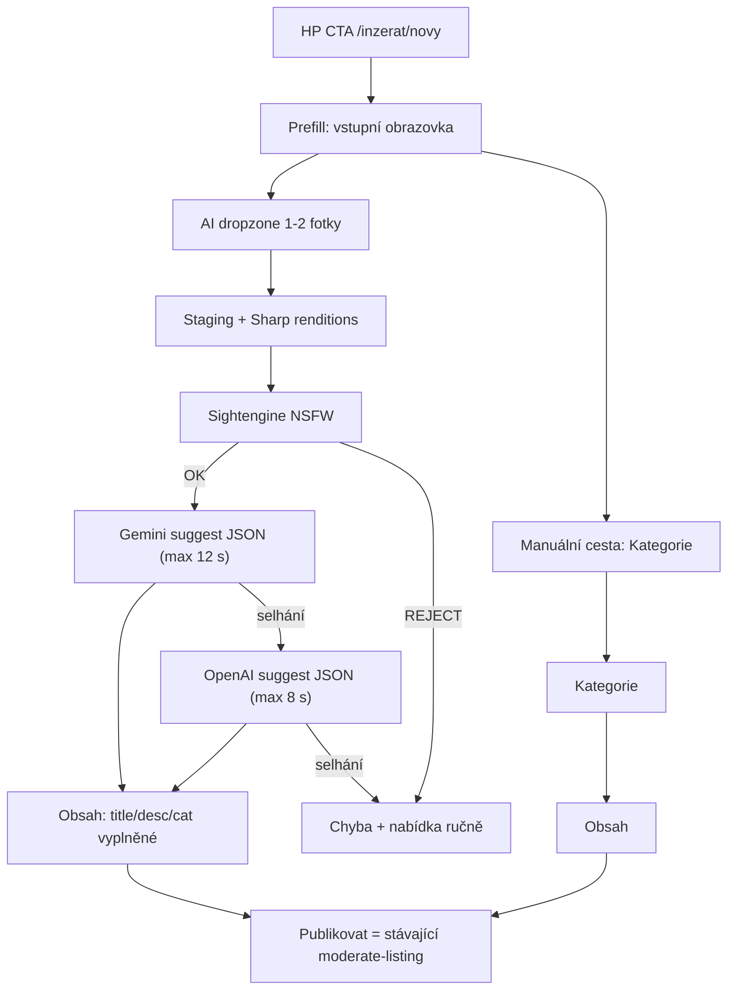

# Metodika — Local Hobby Market

> **Účel:** Srozumitelný přehled všech procesů a postupů, které v projektu mohou nastat. Dokument je určen pro vývojáře, moderátory, produktové vlastníky i kohokoliv, kdo potřebuje rychle pochopit, *co se na webu děje a proč*.  
> **Technická specifikace:** [`PRD_v3.md`](./PRD_v3.md) · **Moderace (implementace):** [`moderace-inzeratu.md`](./moderace-inzeratu.md) · **Hydratace / kvalita inzerátu:** [`hydratace-inzeratu.md`](./hydratace-inzeratu.md) · **NSFW / hard-hit brána:** [`cursor-prompt-nsfw-gate.md`](./cursor-prompt-nsfw-gate.md) · **SEO inzerátů:** [`seo/SEO_BIBLE.md`](./seo/SEO_BIBLE.md)  
> **Datum:** 2026-08-25 (poslední sync s kódem — OpenAI fallback pro Prefill)

---

## Obsah

1. [Jak číst tento dokument](#1-jak-číst-tento-dokument)
2. [Návštěvník bez přihlášení](#2-návštěvník-bez-přihlášení)
3. [Registrace, přihlášení a profil](#3-registrace-přihlášení-a-profil)
4. [Přihlášený uživatel — co může dělat](#4-přihlášený-uživatel--co-může-dělat)
5. [Založení inzerátu](#5-založení-inzerátu)
6. [AI moderace a hydratace](#6-ai-moderace-a-hydratace)
7. [Editace inzerátu](#7-editace-inzerátu)
8. [Detail inzerátu a interakce](#8-detail-inzerátu-a-interakce)
9. [Platnost, expirace a obnovení](#9-platnost-expirace-a-obnovení)
10. [Nahlášení obsahu](#10-nahlášení-obsahu)
11. [Moderátoři a administrátoři (God Mode)](#11-moderátoři-a-administrátoři-god-mode)
12. [Speciální typy inzerátů](#12-speciální-typy-inzerátů)
13. [Globální informační lišta (Site Notice)](#13-globální-informační-lišta-site-notice)
14. [Cookie lišta, GTM a analytika](#14-cookie-lišta-gtm-a-analytika)
15. [Související dokumenty](#15-související-dokumenty)

---

## 1. Jak číst tento dokument

| Pojem | Význam |
|-------|--------|
| **Klient / uživatel** | Návštěvník nebo přihlášený člověk používající web |
| **Inzerát** | Řádek v databázi (`posts`) — zboží, služba, událost nebo nemovitost |
| **Hydratace** | AI doplnění a úprava textu inzerátu (ne technický termín pro uživatele). Ve formuláři = dialog po **Kontrole** (čip „AI vylepšení“) — viz [§5](#5-založení-inzerátu) |
| **Kontrola** | Overlay „Probíhá AI kontrola inzerátu“ — čekání na model, často tu visí. Není to URL. Viz [§5](#5-založení-inzerátu) |
| **Prefill / Kategorie / Obsah** | Pracovní názvy obrazovek založení inzerátu (ne holé „krok 1“). Tabulka v [§5](#5-založení-inzerátu) |
| **God Mode** | Moderátorské nástroje přímo na produkčním webu |
| **`*_no` (inkrementální ID)** | Lidsky čitelné číslo řádku (1, 2, 3…) vedle UUID — v SQL Editoru / Table Editoru hledej podle něj (`log_no`, `evidence_no`, `report_no`, `profile_no`…). Konvence: [`.cursor/rules/db-table-ids.mdc`](../.cursor/rules/db-table-ids.mdc) |

Každá nová uživatelská nebo provozní činnost v projektu **musí být zapsána do této metodiky** (viz také [`PRD_v3.md`](./PRD_v3.md)).

---

## 2. Návštěvník bez přihlášení

### 2.1 Zobrazení homepage (HP)

1. Návštěvník otevře úvodní stránku `/`.
2. V hero sekci vidí hlavní sdělení: u záložky **Vše** H1 **„Online bazar, kde stačí fotka a pár slov.“** (copy v `home-themes.ts`); subline **„Vyfotit, párkrát kliknout, hotovo. AI se postará o zbytek. Rovnou pro lidi z vašeho okolí.“**; značka **zaPikolou.cz** a tagline v hlavičce.
3. Nepřihlášený návštěvník pod hero textem vidí: **„Žádné zdlouhavé registrace. Přihlaste se na jeden klik přes Google nebo klasicky e-mailem.“** (`HomeBrowse.tsx` — tón §1.6 PRD, vykání). Těsně nad H1 skleněná pilulka **„20 inzerátů zdarma“** (`HOME_FREE_QUOTA_BADGE_LABEL`, ikona Sparkles v brand zelené); odkaz na `/balicky-inzerce`. Přihlášeným se nezobrazuje.
4. Pod hero sekcí se zobrazí **přehled inzerátů** — karty s náhledovou fotkou (nebo výchozí ilustrací bez fotky, viz §2.1.2), názvem, cenou, lokalitou a datem v patičce vpravo: **Vytvořeno** (`created_at`), u událostí místo toho **Konání** (`event_date`). Mřížka: **mobil 2×4** (8 karet), **desktop lg+ 3×3** (9 karet); tlačítko **„Zobrazit další“** doplní stejnou dávku (až do načtených 36).
5. Pod výpisem je krátký **SEO text** (`HomeSeoBlurb` / `home-seo.ts`) — lokální bazar a inzerce, odkazy na `/co-je-zapikolou` a `/jak-vytvorit-inzerat`.

### 2.1.1 Časté dotazy (`/faq`)

1. V patičce (sloupec **Co je zaPikolou?**) je odkaz **Časté dotazy**.
2. Stránka `/faq` ukáže accordion — po kliknutí na otázku se odklopí odpověď (najednou jedna otevřená).
3. Texty jsou v [`src/config/faq.ts`](../src/config/faq.ts) (lidsky, ne kopie VOP). Aktuálně ~10 položek (kontakt, rozdíl oproti inzertním webům, Kvalita, „Vytvořeno s pomocí AI“, moderace, účet…). Zmínky VOP / Podmínek inzerce / GDPR / Nahlásit linkuje `LegalLinkedText` (viz root README).
4. Pro SEO: JSON-LD `FAQPage` + záznam v `sitemap.xml`. Právní dokumenty jsou v patičce — na `/faq` se neduplikují.

### 2.1.2 Výchozí ilustrace bez fotky

Když inzerát **nemá** hlavní fotku, karta na HP i detail inzerátu neukazují šedé „Bez fotky“, ale **jemnou výchozí ilustraci** podle kategorie a podkategorie (pastelové pozadí + ikona Lucide + krátký label).

| Soubor | Účel |
|--------|------|
| [`src/config/listing-default-covers.ts`](../src/config/listing-default-covers.ts) | Mapování `categoryType` + `subcategorySlug` → ikona, barvy, label |
| [`src/components/listing/ListingDefaultCover.tsx`](../src/components/listing/ListingDefaultCover.tsx) | UI komponenta |
| `ListingCard` / detail `/inzerat/[slug]` | Použití místo prázdného placeholderu |

**Styl:** jednoduché, nevýrazné, sjednocené (stejná váha ikony, pastelové gradienty, bez fotorealistických stock obrázků).

**Při přidání nové kategorie nebo podkategorie** vždy doplň záznam do `listing-default-covers.ts` (podkategorie v `SUBCATEGORY_COVERS`, jinak spadne na fallback kategorie). Bez toho nová podkategorie dostane jen obecnou ikonu kategorie — vizuální styl přestane sedět.

### 2.1.3 Landing page pro Facebook reklamu (`/prodejte-snadno`)

1. Kampaň míří na **`/prodejte-snadno`**, ne na homepage. Cíl: první inzerát (CTA → `/inzerat/novy`).
2. Globální **header (vyhledávání, poloha, účet) je skrytý**. Stránka má vlastní lištu (logo + Jak to funguje + Vložit inzerát). **Patička webu zůstává** (`SiteFooter`). Mobilní FAB je skrytý — stránka má vlastní CTA.
3. Cookie lišta, GTM a Pixel zůstávají. Po analytickém souhlasu jde do `dataLayer` event `lp_view`. Po **marketingovém** souhlasu Pixel pošle `ViewContent` (`content_name: landing_fb`). CTA mají `data-gtm-id` `cta_lp_header` / `cta_lp_hero` / `cta_lp_footer` a `data-gtm-position`.
4. UTM a `fbclid` se uloží do `localStorage` a přenesou na `/inzerat/novy`. Pokud guest flag C není zapnutý, login wall je zachová v `next`. Přiloží se k Pixel události `Lead`.
5. V patičce (sloupec **Co je zaPikolou?**) je odkaz **Prodejte snadno**.
6. Texty: vykání, žádné časové claimy, AI nedoplňuje cenu, registrace před publikací je zmíněná. Copy: [`src/config/fb-promo-landing.ts`](../src/config/fb-promo-landing.ts). Design: [`docs/fb-ads/Landing page pro Facebook reklamu/`](./fb-ads/Landing%20page%20pro%20Facebook%20reklamu/).

### 2.2 Jak se inzeráty na HP vybírají a řadí

**Krok 1 — poloha návštěvníka (volitelná, bez vynucení)**

- Při **prvním načtení** se **neotevírá** dialog ani dropdown s výběrem polohy — homepage rovnou ukáže obsah.
- V hlavičce je tlačítko **Poloha** (ikona špendlíku). Dokud není poloha nastavená, tlačítko je **zelené** s jemným pulzujícím okrajem (nápověda bez blokování stránky).
- Panel polohy se otevře **až po kliknutí** na tlačítko (nebo při explicitní akci typu „inzeráty v okolí“ bez uložené polohy).
- V panelu uživatel může:
  - zadat obec v našeptávači (Mapy.cz),
  - použít **aktuální polohu** (GPS),
  - zvolit **Zobrazit celou ČR** (vypne filtrování podle polohy).
- Našeptávač i reverse geocode jdou přes náš server (`/api/mapy/suggest`, `/api/mapy/rgeocode`) — Mapy.cz nevidí IP návštěvníka. Chování v UI je stejné.
- Po nastavení polohy pulz zmizí; tlačítko zobrazí zkrácený název obce (např. „Vyškov“).

**Krok 2 — lokální výpis**

- Systém hledá aktivní, neexpirované inzeráty v okolí.
- Okruh se postupně zvětšuje: **15 → 30 → 50 → 60 km**, dokud nenajde alespoň **6** inzerátů.
- Výsledky se řadí primárně podle **vzdálenosti** (nejbližší první).
- U **událostí** má přednost **datum konání** — nejbližší akce jsou nahoře.
- RPC `get_nearby_posts` je **SECURITY DEFINER** (migrace `078`) — RLS na `posts` nefiltruje. Do výpisu patří jen řádky, kde v těle funkce platí `is_post_publicly_visible`. Ten `WHERE` z funkce **nesmí vypadnout**.

**Krok 3 — celostátní fallback**

- Pokud ani v okruhu 60 km není dostatek inzerátů, zobrazí se **nejnovější inzeráty z celé republiky** a uživatel uvidí upozornění, že v okolí zatím nic není.

**Krok 4 — bez uložené polohy**

- Bez uložené polohy (nebo po volbě „celá ČR“) se zobrazí **nejnovější inzeráty celostátně** (bez výpočtu vzdálenosti). Uživatel uvidí upozornění, že výpis není filtrován podle polohy.

### 2.3 Mobilní CTA „Vytvořit inzerát s AI“

- Na mobilu (`md` breakpoint) je vpravo dole plovoucí zelené tlačítko (FAB).
- Když je otevřená **cookie lišta**, FAB se posune **nad lištu** (výška banneru se měří dynamicky), aby nebylo utopené a zůstalo klikatelné.
- Po souhlasu / odmítnutí cookies se FAB vrátí na standardní pozici u spodního okraje.
- FAB (a desktop header CTA) se **nezobrazuje** na `/onboarding`, `/login`, `/prodejte-snadno` a dokud profil nemá přezdívku — jinak by Next.js prefetch `/inzerat/novy` nakešoval redirect na onboarding a po dokončení registrace by tlačítko „nefungovalo“ do obnovení stránky. Po `completeOnboarding` / přihlášení se volá `revalidatePath("/", "layout")`.

### 2.4 Filtrování podle kategorie

- Na HP je **mřížka kategorií** (`CategoryGrid` + `HOME_CATEGORY_GRID_TILES`): **Vše**, zbožové domény, dlaždice **Služby, práce a reality** (bundle → volba typu), **Události**.
- Bundle nemění `category_type` — po výběru zůstává `sluzby` / `prace` / `nemovitost` (stejné formuláře a RPC).
- Deštník **Zboží** zrušen (migrace `070`); starý `?kategorie=zbozi` → **Vše**.
- Hero copy dle aktivní kategorie (`HOME_THEMES`). U **Vše** odkaz **„párkrát kliknout“** → `/jak-vytvorit-inzerat`.
- Stejná mřížka (bez Vše) je v kroku 1 formuláře nového inzerátu.
- **Další fáze:** progressive disclosure podkategorií, date čipy u Událostí.

### 2.5 Vyhledávání na HP

- Uživatel může zadat hledaný výraz (min. **3 znaky**).
- Vyhledávání probíhá v názvu a popisu aktivních inzerátů (RPC `search_posts`, prefix match). Stejně jako nearby je `search_posts` od `078` **SECURITY DEFINER** — viditelnost drží `is_post_publicly_visible` v těle, ne RLS.
- **Bez ohledu na diakritiku** (migrace `071`): např. `beh` najde „běh“.
- Lze kombinovat s kategorií a dalšími filtry (cena, stav, vzdálenost — pokud je poloha k dispozici).

### 2.6 Co návštěvník bez přihlášení vidí a co ne

| Může | Nemůže |
|------|--------|
| Prohlížet HP a detaily inzerátů | Zobrazit telefon nebo e-mail inzerenta |
| Odeslat anonymní poptávku e-mailem | Založit nebo upravit inzerát |
| Nahlásit inzerát přes formulář `/nahlasit` | Nahlásit inline z detailu (vyžaduje přihlášení) |

### 2.7 Navigace a patička

Na všech stránkách je společná hlavička (wordmark **zaPikolou.cz**, vyhledávání, přihlášení, CTA **„Vytvořit inzerát s AI“**) a třísloupcová patička:

| Sloupec | Odkazy |
|---------|--------|
| **Dokumenty** | VOP, **Zásady ochrany osobních údajů** (`/gdpr`), Podmínky inzerce, Zásady cookies, Marketingový souhlas, Limity/Balíčky inzerce, DSA kontaktní centrum, Nahlásit inzerát |
| **Kontakt** | Provozovatel webu (`/kontakt`) |
| **Co je zaPikolou?** | O webu zaPikolou (`/co-je-zapikolou`), Prodejte snadno (`/prodejte-snadno`), Jak vytvořit inzerát (`/jak-vytvorit-inzerat`), **Časté dotazy** (`/faq`), Pro AI (`/llms.txt`) |

V patičce je také odkaz **Nastavení cookies** (znovu otevře cookie lištu), krátký tagline, verze platformy (`0.2`) a rok (`2026`).

### 2.8 Informační stránky

| URL | Účel |
|-----|------|
| `/co-je-zapikolou` | Co web je a není (inzertní nástěnka, ne e-shop); patička **O webu zaPikolou** |
| `/prodejte-snadno` | Landing pro FB reklamu (CTA → `/inzerat/novy`); patička **Prodejte snadno** |
| `/jak-vytvorit-inzerat` | Průvodce v 5 krocích (photo-first prefill → doplnit údaje → kontrola → AI náhled → publikace); demo Elektronika / Kolo / Spotřebič včetně fotek a OCR štítku |
| `/kontakt` | Provozovatel (jméno, e-mail, datová schránka) |
| `/faq` | Časté dotazy — accordion, texty v `src/config/faq.ts` (PRD §11.3) |
| `/cookies` | Zásady používání souborů cookie (právní text z `docs/pravni/cookies.md`) |
| `/gdpr` | Zásady ochrany osobních údajů (`docs/pravni/ochrana-osobnich-udaju-fo.md` / `-osvc.md` dle monetizace) |
| `/marketingovy-souhlas` | Marketingový souhlas (stav „zatím nezasíláme“, odvolání e-mailem) |
| `/dsa` | DSA kontaktní centrum |
| `/vop` | Všeobecné obchodní podmínky (`CURRENT_VOP_VERSION` = `1.11-fo`, snapshoty v `docs/pravni/snapshots/`) |

Stránky jsou veřejné, indexovatelné a v `sitemap.xml` (včetně `/gdpr`).

---

## 3. Registrace, přihlášení a profil

### 3.1 Způsoby přihlášení

1. **Google** — jedním kliknutím (preferovaná cesta).
2. **E-mail a heslo** — po registraci musí uživatel potvrdit e-mail odkazem; bez potvrzení není účet plně aktivní. Na success obrazovce může **znovu odeslat ověřovací e-mail** (UI cooldown 60 s) až po **Turnstile** („nejste robot“). Server navíc povolí nejvýše **10 resendů/h/IP a 3/h/e-mail**. „Poslat znovu“ **zneplatní** předchozí odkaz — platí jen nejnovější mail (Resend SMTP log je zdroj pravdy o doručení). Cíl odkazu je `/auth/dokoncit` (klient zvládne PKCE `?code=` i implicit `#access_token=`); volitelně šablona s `token_hash` → `/auth/potvrdit` + tlačítko.

**Povinné souhlasy při registraci (e-mail i Google):**

- Prohlašuji, že mi je **alespoň 15 let** (včetně souhlasu zákonného zástupce 15–18 let, je-li vyžadován).
- Souhlas s **VOP** (bez něj účet nezaložíme) — včetně verze VOP v okamžiku souhlasu.
- Volitelný souhlas s **marketingem** („až novinky spustíme“) — podrobnosti na `/marketingovy-souhlas`; odesílání zatím neprobíhá.

**Uložení do DB (`profiles`, migrace `044`):**

| Sloupec | Kdy se vyplní |
|---------|----------------|
| `age_confirmed_at` | Při registraci / onboardingu |
| `vop_accepted_at`, `vop_version` | Při souhlasu s VOP |
| `marketing_consent_at` | Jen pokud uživatel zaškrtl marketing; jinak `NULL` |

U **e-mail registrace** bez aktivní session se souhlasy dočasně uloží do auth metadata a po prvním přihlášení se přesunou do `profiles` (`flushPendingRegistrationConsents`). U **Google OAuth** se souhlasy vyplní na **onboardingu** (`/onboarding`), pokud ještě nejsou v DB. Při smazání účtu se audit souhlasů anonymizuje spolu s profilem (RPC `prepare_user_account_deletion`).

**Kam jít po přihlášení (`next`):** Odkazy typu „Přihlásit se a založit inzerát“ mohou nést parametr `next=/inzerat/novy`. Systém povolí jen **interní cesty** na stejném webu — pokusy o `//cizí-doména` se ignorují a uživatel skončí na `/` (ochrana proti phishing redirectu).

### 3.2 První přihlášení — onboarding

1. Po prvním přihlášení systém zkontroluje, zda má uživatel **přezdívku** (`nickname`).
2. Pokud ne, přesměruje na `/onboarding`.
3. Uživatel zadá unikátní přezdívku — tu uvidí sousedé u jeho inzerátů.
4. Teprve po dokončení onboarding může založit inzerát nebo vstoupit do klientské sekce.

### 3.3 Editace profilu

Přihlášený uživatel může upravit:

- avatar (max. 2 MB, komprese v prohlížeči),
- jméno, příjmení, přezdívku,
- volitelné telefonní číslo,
- heslo — sekce **Změna hesla** na `/profil/nastaveni`: stávající + nové + potvrzení; po uložení odhlášení ze všech zařízení. Obnova zapomenutého hesla (e-mailový odkaz → `/auth/nastavit-heslo`) stávající heslo **nevyžaduje**, ale server povolí změnu jen se session, jejíž JWT má čerstvé AMR `recovery` (jinak redirect na zapomenuté heslo).
- smazat účet (GDPR) — sekce **`/profil/nastaveni`**: checkbox „nevratné“ + přepsání e-mailu pro potvrzení → odhlášení a redirect na `/login?message=account_deleted`.

**E-mail nelze změnit** — je zobrazen jen ke čtení. Pro jinou adresu je nutné založit nový účet (po smazání lze stejnou adresu znovu registrovat).

### 3.4 Limity inzerátů

Každý nový účet dostane **20 lifetime publikací** zdarma (balíček `free`). Uživatel to vidí v **`/profil/nastaveni`**:

- štítek plánu **Free**,
- počítadlo **X / Y** (kolik publikací už spotřeboval / celkový limit).

Veřejně se **nenabízí** dokoupení ani ceník (`NEXT_PUBLIC_MONETIZATION_ENABLED=false`). Dlaždice upsellu se nezobrazuje.

**Lifetime model:** každá **první publikace** inzerátu spotřebuje 1 kredit navždy. Smazání nebo expirace kredit **nevrátí**. Obnovení starého inzerátu kredit znovu nebere.

**Vyčerpaný limit:** Na `/profil/nastaveni` a `/inzerat/novy` uživatel vidí upozornění. Tlačítko **Publikovat** je neaktivní; **AI moderace se nespouští** (šetření tokenů).

Zvýšení limitu pro konkrétního uživatele — viz [§11.6](#116-zvýšení-limitu-inzerátů-supabase).

### 3.5 Odhlášení

Uživatel se odhlásí z menu v hlavičce. Při další návštěvě zůstává uložená poloha v prohlížeči, ale přístup k chráněným akcím vyžaduje nové přihlášení.

---

## 4. Přihlášený uživatel — co může dělat

Po přihlášení a dokončení onboardingu má uživatel k dispozici:

| Činnost | Kde | Poznámka |
|---------|-----|----------|
| Zobrazit své inzeráty | `/moje-inzeraty` | Včetně expirovaných, pozastavených a zablokovaných |
| Založit nový inzerát | `/inzerat/novy` | Wizard (fotky/kategorie/obsah) + AI náhled; host může začít bez účtu |
| Upravit vlastní inzerát | `/inzerat/[slug]/upravit` | Změna publikovaného obsahu nebo fotek vyžaduje finální AI kontrolu |
| Obnovit expirovaný inzerát | `/moje-inzeraty` | Prodloužení platnosti |
| Smazat inzerát | `/moje-inzeraty` i detail (owner panel) | Potvrzovací dialog; soft delete |
| Zobrazit kontakt inzerenta | Detail cizího inzerátu | Max. 20× denně |
| Napsat prodejci / pořadateli | Detail inzerátu | Anonymní e-mail |
| Nahlásit inzerát | Detail | Inline tlačítko |
| Prohlížet HP a cizí inzeráty | `/` | Stejně jako nepřihlášený |

---

## 5. Založení inzerátu

Cesta (přihlášený): **`/inzerat/novy` → (volitelně Prefill) → Kategorie / Obsah → Kontrola → Hydratace → Publikace**.

Cesta (host, flag `NEXT_PUBLIC_GUEST_LISTING_DRAFT_ENABLED`): stejný formulář **bez loginu** → při Publikovat login/registrace → návrat na `/inzerat/novy?resume=1` → claim staging + finální AI → publikace. Draft je v **localStorage**; cíl po OAuth drží `sessionStorage` + httpOnly cookie `pending_auth_return_path` (přežije **Zpět** z Google výběru účtu). Detail: [`fb-promo-campaign.md`](./fb-promo-campaign.md).

### Pracovní názvy kroků

V chatu a v docs **nepoužívej holé „krok 1/2/3“** — čísla čipů a kód `step` se neshodují. Agent: [`.cursor/rules/listing-form-steps.mdc`](../.cursor/rules/listing-form-steps.mdc). Čipy: `LISTING_FORM_STEPPER_*` v `src/config/listing-form-ui.ts`.

**Obrazovky** (uživatel něco vyplňuje):

| Říkáme | Čip (photo-first) | Kód `step` | Co tam je |
|--------|-------------------|------------|-----------|
| **Prefill** | 1. Fotky a předvyplnění | `0` | 1–2 fotky, *Předvyplnit inzerát* |
| **Kategorie** | 2. Kategorie | `1` | výběr kategorie (po prefillu se často přeskočí) |
| **Obsah** | 3. Obsah | `2` | název, popis, fotky, cena, stav, lokalita |

Ruční cesta a edit (`/upravit`) začínají na **Kategorie** — Prefill tam není. Čipy pak 1–4.

**Po *Publikovat*** (není samostatná URL):

| Říkáme | Čip | Co to je |
|--------|-----|----------|
| **Kontrola** | 4. AI vylepšení | Overlay „Probíhá AI kontrola inzerátu“ (`MODERATION_CHECKING_UI`) — čekání na preview model. Sem to často visí / timeout (~25–30 s Edge). |
| **Hydratace** | 4. AI vylepšení | Až po odpovědi: dialog náhledu / otázek |
| **Publikace** | 5. Publikace | Druhá kontrola + zápis. Overlay „Ukládám inzerát…“ (`LISTING_FORM_SAVING_UI`) — zase čekání na model. |

**Kontrola** i overlay u **Publikace** jsou pseudo-stránky: `fixed inset-0` v `CreateListingForm` (`isCheckingAi` / `pending`). Žádný route.

Podstavy Hydratace: **Otázky AI**, **Schválení**, **Zamítnutí**.

### Prefill — AI předvyplnění ze fotek (zboží)

Flag: `SUGGEST_FROM_PHOTOS_ENABLED` (`src/config/suggest-from-photos.ts`). Jen **create** (`/inzerat/novy`); edit (`/upravit`) Prefill nemá.

**Cíl:** urychlit založení zbožového inzerátu — uživatel nahraje 1–2 fotky, AI navrhne název, popis a kategorii; cenu, stav a lokalitu doplní sám. Služby / práce / reality / události jdou **ruční** cestou.

#### Rozhodnutí (produkt)

- Taxonomie jen reálné zbožové slugy z `GOODS_CATEGORIES` (`auto`, `detsky`, `dum`, `elektro`, `moda`, `sport`, `hobby`, `ostatni` + podkategorie) — closed vocabulary, žádné vymyšlené slugy.
- Prefill jen zboží. Non-goods → manuální wizard (Kategorie → Obsah).
- Žádný pop-up „AI vs ručně“. Jedna stránka: primární AI dropzone (~2/3) + viditelný manuální blok (~1/3).
- Oddělená Edge funkce `suggest-listing-from-photos` — `moderate-listing` (publish gate) beze změny.
- Prefilluje: `title`, `description`, `categoryType`, `subcategorySlug`. **Ne** cena, stav, lokalita.
- Sightengine = autoritativní NSFW gate. Draft generuje Gemini (`SUGGEST_LISTING_MODEL`, default `gemini-3.5-flash-lite`), při technickém selhání OpenAI (`SUGGEST_FALLBACK_MODEL`, default `gpt-5.4-nano`). `MODERATION_FINAL_*` se na Prefill nepoužívá.
- Staff srovnání modelů: Edge `compare-suggest-from-photos` + `/mod/prefill-lab` (stejný prompt/schema, bez DB).
- Hosté: stejný flow (guest visitor + podpis, rate limit `guest_suggest_from_photos`, Turnstile po soft limitu). Nové visitor cookie max. 10/h/IP; globální strop guest AI 40/h a 300/den (`guest_ai_spend`). IP pro limity z `x-vercel-forwarded-for` / `x-real-ip` / XFF **zprava** (ne zleva).

#### UX flow



**Vstupní obrazovka (Prefill):**

- Dominantní karta: „Pro začátek stačí dvě fotky.“ Podnadpis: „Napíšeme základní název a popis, vy je pak doladíte a doplníte cenu, stav a lokalitu.“ Na **mobilu** dvě akce **Vyfotit** (`capture=environment`, světle emerald tlačítko — preferovaná cesta) a **Vybrat z galerie** (čárkovaný obrys); na desktopu dropzone. Max. 1–2 fotky (při třetí se nechá poslední dvojice). CTA **„Předvyplnit inzerát“** (ne „Vytvořit inzerát“ — to je publikace), loader (Kontrola → Analýza → Předvyplnění).
- Spodní blok (~1/3): „Služby, události, práce, reality — nebo raději ručně“ + CTA **„Vyplnit inzerát ručně“** → **Kategorie** (CategoryGrid).
- Po úspěchu: skok na **Obsah**, fotky v uploadu, název/popis/kategorie vyplněné. **Cena, stav a lokalita** zůstanou prázdné — stav má „— vyberte —“, žlutý prstenec jen u ještě nevyplněného pole (`listingFormPrefillHighlightClass`). Publikovat nelze, dokud stav, lokalita a cena nesedí. V popisu řádky `Doplňte značku: ` (psát za dvojtečku, nebo smazat) — ne stav/cena/lokalita, ty mají pole formuláře. Banner zve k dalším fotkám a úpravě textu (Prefill má 1–2 fotky, Obsah až 6).
- Nízká jistota podkategorie (`confidence < 0.7` nebo neplatný slug) → `subcategorySlug` null → **Kategorie** s textem, uživatel vybere podkategorii.
- Fail-soft (NSFW / timeout / rate limit): inline chyba, zůstává na **Prefill**, manuál dostupný.

#### Backend `suggest-listing-from-photos` (stručně)

1. Auth JWT **nebo** guest visitor + token; rate limit `suggest_from_photos` (20/h) / `guest_suggest_from_photos` (5/h, soft=hard). Navíc globální `guest_ai_spend` (40/h, 300/den UTC) — až po per-IP limitu, před Sightengine.
2. Staging + Sharp renditions (512 Sightengine / 1024 Gemini) — stejné buckety jako u moderace.
3. Sightengine NSFW na všech fotkách.
4. Gemini structured JSON (max. 12 s); při technickém selhání OpenAI fallback (max. 8 s). Celý request má deadline 28 s, takže čas spotřebovaný načtením fotek a Sightenginem může limit primary zkrátit. Blokace Gemini po úspěšném Sightengine je technické selhání generátoru, ne NSFW verdikt.
5. Server validace goods páru; odpověď `{ title, description, categoryType, subcategorySlug, confidenceScore }` — **bez** approval tokenu a bez hydratace.

Closed vocabulary do Edge generuje `npm run sync:moderation` → `goods-taxonomy.ts`. Anti-halucinace: brand/velikost/materiál jen pokud jsou na fotce čitelné; žádná cena; non-goods → `ostatni` + nízké confidence. Nejisté údaje jdou **pod** odstavec nabídky jako `Doplňte značku: ` (jeden na řádek, psát za dvojtečku) — prompt + `formatDoplnitPlaceholders` (řádky na stav/cenu/lokalitu se zahodí, mají pole formuláře). Při publikaci prázdné výzvy zmizí, vyplněné se změní na `Značka: …` (`stripDoplnitPlaceholders`).

Po prefillu publish = stávající `moderate-listing` (Sightengine + hydratace + token). Prefill **nenahrazuje** publish gate. Samostatná AI inference pro Prefill a publish je záměr.

#### DB

Žádné nové tabulky. Jen enum hodnota `suggest_from_photos` (migrace `074`) a textová guest akce ve stávající `anonymous_rate_limits` (`073`).

#### Co v MVP záměrně není

- Odhad ceny / prefill stavu a lokality.
- Cache verdiktu Sightengine podle image hash (prefill + preview + final dnes volají API znovu) — dává smysl costově, realizace později.
- Auto-zařazení služeb/událostí z fotky.

Deploy: `npm run sync:moderation` → `supabase functions deploy suggest-listing-from-photos`. Smoke checklist: [`TO-DO-dalsi-den.md`](./TO-DO-dalsi-den.md) § K.

#### Prefill lab — srovnání modelů (staff, 2026-08-09)

Ruční A/B bez zásahu do produkčního trafficu. Cíl: často měnit kandidáty modelů (turbulentní pricing/kvalita) a rozhodnout switch `SUGGEST_LISTING_MODEL` podle side-by-side výsledků.

| | |
|--|--|
| **UI** | `/mod/prefill-lab` (God Mode → Prefill lab), jen `moderator` / `admin` |
| **Edge** | `compare-suggest-from-photos` |
| **Pipeline** | Stejný prompt + schema + parse jako produkce (`run-suggest-listing.ts`). Dvě **sekvenční** volání; liší se jen `provider` + `model`. |
| **Bez** | `moderation_checks`, produkční rate limity, Sightengine (srovnává se klasifikace, ne NSFW gate) |
| **Default A** | `gemini` / `gemini-3.5-flash-lite` (Edge fallback: secret `COMPARE_SUGGEST_ARM_A_MODEL` → `SUGGEST_LISTING_MODEL` → kódový default) |
| **Default B** | `openai` / `gpt-5.4-nano` (Edge fallback: `COMPARE_SUGGEST_ARM_B_MODEL` → kódový default) |
| **UI override** | Provider + model u obou ramen editovatelné před každým během |

Konfig UI defaultů: `src/config/compare-suggest-from-photos.ts`. Deploy labu: `npx supabase functions deploy compare-suggest-from-photos`. Hydratační lab (preview model) = **samostatný** budoucí scope, stejný pattern.

### Kategorie

Uživatel vybere (manuální cesta, nebo doplnění po Prefillu):

- **Typ:** zbožová doména / Služby / Událost / Nemovitost / Práce
- **Podkategorii**
- **Stav nebo typ nabídky** podle kategorie (ve formuláři až na **Obsahu**):
  - Zboží: Nové, Jako nové, Použité, Poškozené / na díly
  - Služby: Jednorázově, Dlouhodobě, Záskok
  - Události: Jednorázová / Pravidelná akce
  - Nemovitosti: Prodej / Pronájem

### Obsah — název, popis, cena, stav a lokalita

| Pole | Pravidla |
|------|----------|
| Název | Povinný, max. 80 znaků (AI H1 cílí na ~60); slouží i pro SEO a URL |
| Popis | Min. 10, max. 2000 znaků; hrubý text stačí — AI ho může upravit |
| Lokalita | Povinná; našeptávač Mapy.cz nebo „Použít aktuální polohu“ — obec musí být **potvrzena z našeptávače** (GPS doplní souřadnice). Volání Mapy.cz jde přes server (`/api/mapy/*`). |
| Typ ceny | Podle kategorie — detail v [§12](#12-speciální-typy-inzerátů). U **zboží**: Pevná, Za odvoz, Dohodou, Výměnou, Nabídni. U **služeb**: Hodinová sazba, Cena za zakázku, Dohodou. |
| Platnost | U zboží, služeb a nemovitostí: 1–365 dní (výchozí 30); u událostí se nevybírá — platí datum akce |
| Datum akce | U událostí povinné; musí být v budoucnosti (při novém založení) |
| Vícedenní akce | Checkbox **Vícedenní akce** — konec musí být **jiný kalendářní den** (Praha) než začátek. U pravidelné akce (`long_term`) konec není. |
| Soukromá událost | Checkbox **Soukromá událost** — hint: *Akce nebude zobrazená na webu, jen přes odkaz.* Není na HP / ve vyhledávání; detail podle slugu ano. |
| Odkaz (událost) | Volitelný checkbox „Mám další informace na webu nebo sociálních sítích“ → pole URL. Server normalizuje na `https://`, odmítne mezery, IP, credentials a známé adult/tube/cam domény (`src/lib/posts/external-url.ts`). |
| Kontaktní preference | Volitelné zobrazení e-mailu / telefonu po kliknutí na „Zobrazit kontakt“ |

#### Povinná pole — hvězdička a legenda

Povinná pole označuje **červená hvězdička** v labelu (Název, Popis, Lokalita, Cena u typů s částkou, Datum akce u událostí, telefon při zobrazení kontaktu).

- Hvězdička je v samostatném `<span>` s třídou `listingFormRequiredMarkClass` — oddělená mezera (`margin-left`), barva `#e53e3e`, mírně větší než text labelu, aby se nelepila na závorky (např. u „Orientační cena (Kč)“).
- Těsně **nad tlačítky Zpět / Publikovat** je šedá legenda: **„\* Označená pole jsou povinná.“**
- Hvězdička má `aria-hidden="true"` — čtečky obrazovky spoléhají na legendu a na validaci formuláře.

Konfigurace: `src/config/listing-form-ui.ts` (`listingFormRequiredMarkClass`, `LISTING_FORM_REQUIRED_LEGEND`).

### Fotografie (na obrazovce Obsah)

- Max. **6 fotek** (JPEG, PNG, WebP).
- Každá se před nahráním zkomprimuje na max. **1 MB** (nejdelší strana max. 1920 px).
- Originál se při AI kontrole nahraje **jednou** do privátního stagingu; Server Action přes Sharp připraví menší WebP varianty (Gemini 1024 px, Sightengine 512 px). Uživatel to nevidí — v UI zůstává stejný upload.
- Uživatel označí **hlavní fotku** (hvězdička) — ta je náhled na HP a referenční snímek pro cross-validaci text ↔ foto. AI hydratace vychází ze **všech** nahraných fotek.
- **Všechny** fotky procházejí bezpečnostní kontrolou, nejen hlavní.

#### Nápověda u nahrávání fotek

Pod nadpisem **Fotky** (pole je volitelné, ale doporučené) uživatel vidí:

1. **Tip** — stručný popisek + fotka + AI doplnění textu. Příklad ve větě se mění podle **kategorie a podkategorie**, např.:
   - Elektronika → „Prodám funkční mobil“
   - Auta a moto → „Prodám použité auto“
   - Služby → „Nabízím úklid bytu“
2. Max. 6 fotek (**Obsah**) / 1–2 u **Prefillu**, automatická komprese pod 1 MB. Na mobilu **Vyfotit** a **Vybrat z galerie** (jeden input bez `capture` na Androidu otevře jen galerii).
3. Hvězdičkou hlavní fotka na homepage.
4. Bezpečnost fotek hlídá AI kontrola.
5. HEIC/HEIF z telefonu se na klientovi převede na JPEG/WebP, pokud to prohlížeč umí dekódovat; jinak hláška ať použije **Vyfotit**. Samsung galerie: soubory se hned kopírují do paměti (jinak Chrome po chvíli odepře čtení — anglické „could not be read / permission problems“ nebo „Failed to fetch“; UI vždy česky). Do paměti jdou jen fotky v limitu (prefill 1–2, formulář max. 6) a pod 25 MB; komprese běží po jedné. Při výběru víc než 6 fotek najednou: krátká hláška „Přidali jsme N fotek. Kvůli limitu 6 jsme vynechali M fotek.“ — ne seznam názvů souborů. Chyba je v prohlížeči, ne ve Vercel/Supabase logu.

Mapa příkladů: `src/config/listing-form-tips.ts` (`getListingFormTipExample`). Komponenta: `ListingImageUpload`.

### Hydratace a Publikace

Po kliknutí na **„Publikovat inzerát“** (pokud má uživatel **zbývající kredit**):

1. **Kontrola** — celoobrazovkový overlay „Probíhá AI kontrola inzerátu“ (spinner, „Může to trvat i 15 sekund.“). Uživatel nemá kam kliknout; když model visí, visí tady.
2. Proběhne [AI moderace a hydratace](#6-ai-moderace-a-hydratace) (viz detailní popis níže) — **první kontrola**: náhled / úprava textu. Approval token ještě **nevzniká**. Overlay zmizí, až Edge odpoví (nebo timeout / technická chyba).
3. Uživatel v modalu potvrdí finální text (může ho i celý přepsat, nebo zvolit původní bez AI úprav).
4. **Publikace** — overlay „Ukládám inzerát…“; **druhá kontrola** přesného textu a fotografií. Teprve pak Edge vydá jednorázový approval token. Zase čekání na model.
5. Server Action uloží inzerát nejprve jako **`draft`**, nahraje fotky a přes service-role RPC **`publish_approved_post`** přepne na **`active`** jen při shodě tokenu s uloženým obsahem.
6. URL má tvar `/inzerat/[slug]` — slug se generuje při první publikaci a **nemění se** při editaci.

**Proč dvě kontroly:** první slouží k hydrataci a náhledu. Token ale musí patřit k textu, který uživatel **skutečně publikuje** — ne k prvnímu AI návrhu. Když po náhledu text přepíše (i na závadný obsah), druhá kontrola to znovu posoudí; při zamítnutí token nedostane a na web se nedostane. „Token sedí“ znamená: DB při publikaci ověří, že uložený inzerát (a fotky) jsou totéž, co druhá kontrola schválila — jinak zůstane **Koncept** (`draft`).

Pokud publikace selže (chybí/neplatný token / neshoda obsahu), inzerát zůstane ve stavu **Koncept** (`draft`) — majitel ho najde v `/moje-inzeraty` a může doupravit.

---

## 6. AI moderace a hydratace

Toto je klíčový proces při založení i úpravě inzerátu. Uživatel ho vnímá jako „AI náhled a doplnění“.

### AI modely — aktuální defaults

> **Aktualizace: 2026-08-25.** Modely se mohou měnit přes Supabase secrets. Zdroj pravdy v kódu: `resolve-moderation-ai-target.ts`, `resolve-suggest-ai-target.ts`, prefill lab UI `compare-suggest-from-photos.ts`. Detail A/B: [`moderace-inzeratu.md`](./moderace-inzeratu.md) → Volba Gemini modelu.

| Použití | Edge / fáze | Secret | Default |
|---------|-------------|--------|---------|
| **Photo-first Prefill primary** (zboží) | `suggest-listing-from-photos` | `SUGGEST_LISTING_MODEL` | `gemini-3.5-flash-lite` |
| **Photo-first Prefill fallback** | `suggest-listing-from-photos` | `SUGGEST_FALLBACK_MODEL` | `gpt-5.4-nano` |
| **Prefill lab** (staff `/mod/prefill-lab`) | `compare-suggest-from-photos` | request `armA`/`armB` (volitelně `COMPARE_SUGGEST_ARM_*_MODEL`) | A: flash-lite, B: `gpt-5.4-nano` |
| **Moderace — preview** (hydratace, náhled) | `moderate-listing`, `issueApproval` vypnuto | `GEMINI_MODEL` | `gemini-2.5-flash` |
| **Moderace — final** (approval token) | `moderate-listing`, `issueApproval: true` | `MODERATION_FINAL_PROVIDER` + `MODERATION_FINAL_MODEL` | provider `gemini`, model `gemini-3.5-flash-lite` |
| **OpenAI** (fallback / A/B final) | `moderate-listing` | `OPENAI_MODERATION_MODEL` | `gpt-4o-mini` |
| **NSFW fotky** (pre-Gemini) | obě Edge funkce | Sightengine API | model `nudity-2.1` |

Poznámky:
- Prefill **nepoužívá** `MODERATION_FINAL_*` ani `OPENAI_MODERATION_MODEL`.
- Pokud chybí Gemini klíč, OpenAI je primary a `used_fallback = false`; pokud chybí OpenAI klíč, zůstává Gemini-only fail-soft.
- Timeout Prefillu: celý request 28 s, uvnitř Gemini nejvýše 12 s + OpenAI nejvýše 8 s; moderace a lab bez override používají 25 s.

### 6.1 Proč to existuje

1. **Bezpečnost** — zabránit nelegálnímu obsahu (drogy, zbraně, porno, CSAM…).
2. **Ochrana AI klíče** — hrubě závadný obsah odříznout *před* Gemini (Google Prohibited Use Policy).
3. **Kvalita** — srozumitelný text, doplněné parametry podle kategorie.
4. **Ochrana kontaktů** — telefony a e-maily nepatří do veřejného popisu.

### 6.2 Kdy se spouští

| Akce | Spouští AI? |
|------|-------------|
| Nový inzerát — publikace | Ano |
| Změna publikovaného obsahu nebo fotek | Ano |
| Změna ceny, lokality, stavu, data/platnosti či kontaktních voleb | Ano — jde o publish-sensitive obsah |

### 6.3 Průběh krok za krokem

```
Formulář → klik „Publikovat“ / „Uložit“
    → Edge Function moderate-listing
        → 1) hard-hit text (CSAM fráze) — bez Gemini
        → 2) Sightengine NSFW na fotky — bez Gemini
        → 3) AI: Gemini / GPT (timeout ~25 s; **preview** = `GEMINI_MODEL` / default `gemini-2.5-flash`; **final** = `MODERATION_FINAL_*` / default `gemini-3.5-flash-lite` — viz [AI modely](#ai-modely--aktuální-defaults) a [`moderace-inzeratu.md`](./moderace-inzeratu.md))
        → TECHNICAL_ERROR → amber panel „Technická chyba“ + „Zkusit znovu“
           (klient až 3 pokusy; není to obsahové zamítnutí)
           včetně výpadku Sightengine (`SIGHTENGINE_UNAVAILABLE`)
        → REJECTED     → popup „Inzerát nesplňuje pravidla“, nic se neuloží
           (včetně HARD_HIT_TEXT / NSFW_IMAGE z pre-brány)
        → NEEDS_QUESTIONS → modal s náhledem textu + doplňující otázky
        → APPROVED     → modal s náhledem upraveného textu
    → uživatel volí v modalu
        → Doplnit, upravit a publikovat
        → Ignorovat AI a publikovat původní
        → Zrušit (návrat do formuláře)
    → finální moderate-listing(issueApproval: true)
        → kontroluje text/fotky, které uživatel právě odesílá
          (i když je po náhledu celý přepsal)
        → při REJECTED token nevzniká → publikace na active nejde
        → při OK: approvalToken = fingerprint + SHA-256 fotek
    → Server Action createListing / updateListing
        → insert/update jako draft
        → upload fotek (při chybě soft-delete draftu — žádný orphan)
        → service-role publish_approved_post(token, image bindings)
        → DB porovná autoritativní posts + post_images → active/hidden
          (neshoda s tokenem = zůstane draft)
```

**Proč `issueApproval` až po modalu:** první volání jen připraví náhled. Token se vydá až z druhé kontroly finálního obsahu — jinak by šlo po schválení vyměnit text/fotky a publikovat něco jiného. Přepsání textu v modalu token „nerozbíjí“ omylem: druhé volání kontroluje právě to, co uživatel odesílá.

**Důležité:** AI se volá přímo z prohlížeče do Supabase (ne přes Next.js), aby nedocházelo k timeoutům. Klíče k AI a Sightengine jsou jen na serveru Edge Function (Supabase secrets). **Publikaci na `active` nelze obejít** — migrace `063` dovoluje publish RPC jen `service_role` a vyžaduje platný token pro přesný finální obsah i přesné soubory fotografií. Migrace `066` zajišťuje, že stejným bezpečným tokem procházejí také vlastní inzeráty moderátorů/adminů; staff bypass platí jen pro God Mode úpravu cizího inzerátu. Edge počítá hashe z bajtů, které AI skutečně kontrolovala; Server Action před publikací stáhne aktuální Storage objekty a DB atomicky porovná jejich identitu, pořadí, hlavní obrázek a hashe. Před odesláním formulář ukáže **„Chybí: …“**, pokud není lokalita / název / popis / cena.

### 6.4 Pre-Gemini brána (hard-hit text + NSFW fotky)

Cíl: **neposílat očividně závadný obsah do Gemini/OpenAI**. Snižuje riziko omezení Google API klíče. **Není to plná CSAM detekce** (hash matching = budoucí úkol) — jen nudity/porn gate + hard-hit klíčová slova.

Podrobné zadání a rizika: [`cursor-prompt-nsfw-gate.md`](./cursor-prompt-nsfw-gate.md), [`riziko-gemini-api-zakazany-obsah.md`](./riziko-gemini-api-zakazany-obsah.md).

| Krok | Co dělá | Při hit |
|------|---------|---------|
| **Hard-hit text** | `checkHardHitText` na název + popis (CZ/EN fráze, leetspeak) ze `hard-hit-terms.ts` | `REJECTED` + `errorCode: HARD_HIT_TEXT`, Gemini se **nevolá** |
| **Sightengine** | Model `nudity-2.1` na každou fotku (base64); prahy níže | `REJECTED` + `errorCode: NSFW_IMAGE`, Gemini se **nevolá** |
| **Sightengine výpadek** | Timeout 5 s / chyba API / chybějící secrets | `TECHNICAL_ERROR` / `SIGHTENGINE_UNAVAILABLE` — **ne** do Gemini, **ne** hard-reject counter |

#### Sightengine — která pole z JSON vyhodnocujeme

API vrací objekt `nudity` (model `nudity-2.1`). Kód (`sightengine.ts`) rozhoduje **jen** podle těchto skóre:

| Pole v JSON | Práh (konstanta) | Reason při rejectu |
|-------------|------------------|--------------------|
| `nudity.sexual_activity` | **> 0.6** (`NSFW_NUDITY_RAW_THRESHOLD`) | `nudity_raw` |
| `nudity.sexual_display` | **> 0.6** | `nudity_raw` |
| `nudity.erotica` | **> 0.8** (`NSFW_NUDITY_PARTIAL_THRESHOLD`) | `nudity_partial` |
| `nudity.raw` / `nudity.partial` | stejné prahy | legacy (starší model, pokud API ještě vrátí) |

**Nevyhodnocujeme** (i když API vrátí): `suggestive`, `very_suggestive`, `mildly_suggestive`, `none`, `suggestive_classes` (lingerie, bikini, cleavage…), `context`.

**Ukládání celého JSON (migrace `056`):** u každé fotky, kterou Sightengine stihne zkontrolovat, ukládáme **celé API tělo** (ne jen `nudity`) do jednoho sloupce `sightengine_responses` (JSONB pole max. 6 položek tvaru `{ imageIndex, response? , error? }`). Zápis:
- při NSFW reject / výpadku → `moderation_hard_reject_evidence` **i** `moderation_checks`,
- při průchodu bránou → `moderation_checks` (spolu s APPROVED / NEEDS_QUESTIONS / pozdější REJECTED od Gemini).

Důsledek: fotka osoby v prádle může mít `suggestive` / `lingerie` ≈ 0.99 a přesto **projít** Sightenginem — sémantiku (escort návnada vs. prodej věci) řeší Gemini (`sexual_services`). Hard nudity (sexuální aktivita / erotica) odřízne Sightengine před Gemini.

**Evidence (migrace `054`):** tabulka `moderation_hard_reject_evidence` + privátní bucket `moderation-evidence`. Ukládá se *před* vytvořením inzerátu (v requestu jsou jen base64, ještě není `post_id`). **Nesouvisí** s `/mod/karantena` (`blocked` inzeráty z reportů).

**Hard reject (1.–2.):** UI dialog — inzerát porušuje podmínky; nesouhlas → `info@zapikolou.cz` (`SITE_OPERATOR_CONTACT_EMAIL`, ne osobní gmail z env). Evidence + counter.

**Hard stop (3× / 24 h):** migrace **`055`** — tabulka `account_blacklist` (klíč = normalizovaný e-mail, `source` = `automatic` | `manual`, soft unban přes `removed_at`). Skrytí/obnova inzerátů vyžaduje **`057`** (`GRANT UPDATE ON posts TO service_role`) — bez toho hide tiše spadne `42501`.

| Akce | Chování |
|------|---------|
| Insert blacklist | Edge při 3. hitu (`3_hard_rejects_24h`) nebo staff v `/mod/blacklist` |
| Skrytí inzerátů | `active` / `hidden` → `blocked` + `status_reason_code = account_blacklist` (bez mazání; draft/archived nechá); UI hlásí počet / chybu hide |
| Gate | Middleware + `is_email_blacklisted()` → `/ucet-pozastaven`; Edge odmítne `ACCOUNT_BLACKLISTED` |
| E-mail (SoR) | Kontakt vždy `info@…`. Při **novém** hard stopu i při unbanu (Resend). Auto-ban: Edge → `POST /api/internal/notify-account-hard-stop` (`CRON_SECRET`). Ruční: server action. |
| Odebrání z blacklistu (unban) | Soft remove + důvod + **obnova inzerátů** + e-mail — viz níže |
| Retence | Cron `/api/cron/purge-hard-stop-evidence` — evidence + snapshoty + *historie* blacklistu po **730 dnech**; aktivní blacklist se nemaže |

#### Obnova účtu po omylu (odebrání z blacklistu)

Když uživatel napíše na `info@zapikolou.cz` (nebo po ruční kontrole evidence) a **uznáte, že obsah neporušuje pravidla** / šlo o false positive:

1. Otevřete **`/mod/blacklist`** (God Mode — staff).
2. U aktivního řádku vyplňte **důvod odebrání** (např. „omyl — běžný prodej oblečení, ne escort“) a klikněte **Odebrat z blacklistu**.
3. V DB se nastaví `removed_at`, `removed_by`, `removed_reason` — řádek zůstane v historii (`?historie=1`), unikátní aktivní e-mail se uvolní.
4. **Účet znovu funguje** — middleware už neresměruje na `/ucet-pozastaven`, uživatel se může přihlásit a zakládat nové inzeráty.
5. **Inzeráty se obnoví automaticky** — všechny s `blocked` + `status_reason_code = account_blacklist` jdou zpět na **`active`** (důvod se vymaže). Inzeráty zablokované jiným důvodem (`moderation`, `reports_threshold`) se **nedotknou**.
6. Uživatel dostane **e-mail** o zrušení pozastavení (včetně poznámky moderátora).

Evidence hard rejectů (`moderation_hard_reject_evidence`) ani snapshoty v bucketu se unbanem **nemažou** — zůstanou pro audit / policii do retence 24 měsíců.

Konfigurace: `NSFW_NUDITY_*_THRESHOLD`, `HARD_REJECT_AUTOBAN_THRESHOLD`, `HARD_STOP_EVIDENCE_RETENTION_DAYS` v `src/config/`. Secrets: `SIGHTENGINE_API_USER`, `SIGHTENGINE_API_SECRET`, na Edge také **`CRON_SECRET`** (+ volitelně `SITE_URL`) pro SoR e-mail po auto-banu.

### 6.5 Co AI kontroluje na fotkách

| Kontrola | Rozsah |
|----------|--------|
| Pre-brána NSFW (Sightengine) | **Všechny** nahrané fotky — *před* Gemini (viz §6.4) |
| Bezpečnostní filtr AI | **Všechny** nahrané fotky (max. 6) |
| Shoda text ↔ foto | Hlavní fotka vs. název a popis |
| Doplňující otázky (hydratace) | **Všechny** fotografie + kategorie (hlavní fotka jen pro cross-validaci) |

Pokud **jedna** fotka porušuje pravidla, celý inzerát je zamítnut — výběr „čisté“ hlavní fotky neobejde kontrolu ostatních.

### 6.6 Co je hydratace textu

**Hydratace** = AI vezme hrubý nástřel od uživatele a připraví strukturovaný inzerát (pravidla: [`seo/SEO_BIBLE.md`](./seo/SEO_BIBLE.md)):

1. **H1 / název** (`cleanedTitle`) — obecný název věci první, max ~60 znaků, bez vaty a bez lokality.
2. **Úvod** — až 6 vět (synonyma, cena, předání / dojezdová vzdálenost, CTA přes web).
3. Oddělovač `---`
4. Sekce **Parametry** — odrážky ve tvaru `• Popisek: hodnota`
5. **Meta description** + **alt hlavní fotky** — ukládají se do `meta_description` / `image_alt` (jen při volbě AI textu).

Document `<title>` skládá kód (`buildListingMetaTitle`), ne AI.

Příklad po hydrataci:

```
Prodám dětské kolo Velo v dobrém stavu. Cena 800 Kč, osobní předání v Brně-Líšni.
Pro více informací napište prodejci zprávu přes web.
(u práce: „…napište zadavateli…“; u služeb poskytovateli; u události pořadateli; u nemovitosti inzerentovi — viz `listing-cta.ts`)
---
Parametry
• Značka: Velo
• Velikost kol: 20"
• Stav: použité, bez rezervy
```

Hydratace vychází z:

- textu, který uživatel napsal,
- kategorie a podkategorie (každá má vlastní AI pokyny v `categories.ts`),
- metadat z formuláře (cena, stav, datum akce, **lokalita**, u události volitelný **odkaz** — na cenu/stav/datum se AI znovu neptá, pokud už jsou vyplněná),
- **všech** nahraných fotografií (vizuální kontext; hlavní fotka navíc pro shodu text ↔ náhled),
- u jasně identifikovaného výrobku (značka + model / typ / motorizace) v **jakékoli** kategorii zboží i **katalogových vlastností** s jistotou. Kusové údaje (nájezd, vady, příslušenství v balení) jen z textu/fotek.

**Formulář má při hydrataci přednost** (cena, `eventDate`, lokalita, u události `external_url`): neshoda volného textu s polem formuláře **není** důvod k `REJECTED`; Edge přepíše údaj do `cleanedDescription` / Parametrů. Stejně vyplněné řádky **„Doplňte X: hodnota“** v popisu (např. materiál: bronz) — klient je zapíše do Parametrů a stejnou otázku v hydrataci zahodí; AI je často smaže a zeptá se znovu. Pole `eventDate` se do Edge i do uložení posílá jako **ISO UTC** (zeď `Europe/Prague`) — jinak Vercel v UTC posune 15:00 na 13:00 a publish gate (`content_mismatch`) editaci události zablokuje. U události s vyplněným odkazem (Facebook / Instagram / web) AI **nevkládá** CTA „napište pořadateli zprávu přes web“ — odkaz je samostatné tlačítko pod inzerátem. Technický detail: [`hydratace-inzeratu.md`](./hydratace-inzeratu.md) → *Filtr redundantních otázek (formulář má pravdu)*. Po ruční úpravě textu v modalu už to neplatí stejně — viz §6.8.1.

### 6.7 Stav NEEDS_QUESTIONS — doplňující dotazník

Když AI zjistí, že v inzerátu chybí **kritické informace** pro danou kategorii, nezamítne ho hned — vrátí stav `NEEDS_QUESTIONS` a položí **1–5 otázek**.

**Příklady podle kategorie:**

| Kategorie | Co AI typicky doplní / na co se zeptá |
|-----------|--------------------------------------|
| Zboží (auto, elektronika) | Rok, nájezd, kapacita, záruka… |
| Zboží (móda — boty/hodinky) | Deterministicky i stélka / mm rozměry (`required-category-questions.ts`) |
| Zboží (zjevně dětské) | Deterministicky 1× „Věk / výška“, pokud chybí věk, výška i velikostní pásmo; u bot se stélkou/velikostí se neptá znovu |
| Služby | Dojezd, materiál, rozsah práce; typ ceny (hodina vs. zakázka) respektuje formulář |
| Události | Kapacita (datum/čas z formuláře — neptat; lokalita z formuláře — neptat) |
| Události → Sport | Deterministicky výbava/speciální vybavení s sebou, pokud text nic neříká |
| Nemovitosti | Dispozice, výměra, vybavení |

Povinné/deterministické otázky: [`src/config/moderation/required-category-questions.ts`](../src/config/moderation/required-category-questions.ts) (+ sync do Edge). Při nové podkategorii se specifickým doptáváním doplň i sem.

**Průběh pro uživatele:**

1. Modal **„AI vám vylepšila inzerát!“** — náhled AI textu (textarea max. 6 řádků, scroll uvnitř).
2. Vedle **„Popis inzerátu“** soft indikátor **Kvalita X %** (deterministicky z fotek, textu a odpovědí — ne predikce prodeje; SEO pole skóre neovlivňují). Max. jeden tip; u nezodpovězených otázek např. **„Tip: doplňte detaily níže.“** s odkazem na sekci níže. Nízké skóre **neblokuje** publikaci. Detail: [`hydratace-inzeratu.md`](./hydratace-inzeratu.md) § Kvalita inzerátu.
3. Sekce **„Vylepšete svůj inzerát“** — volitelné doplňující otázky (1–5). Nevyplněné otázky **publikaci neblokují**; vyplněné odpovědi se doplní do Parametrů (a zvednou skóre).
4. Po potvrzení se odpovědi **automaticky doplní** do sekce Parametry (s jednotkami — rozměry v **cm**, objem v **ml**, pokud uživatel jednotku nevyplní).
5. Odpovědi se **neukládají zvlášť** v databázi — jsou součástí finálního popisu.

**Jednotky v Parametrech:** AI se ptá s jednotkou v otázce (např. „Jaké jsou rozměry v cm?“) a `paramLabel` sladí s očekávaným parametrem (`Rozměry`, `Objem`). Klient při slučování odpovědí doplňuje `cm` / `ml`, pokud chybí.

**Limity délky:**

- Finální popis max. **2000 znaků**.
- Při dotazníku AI drží náhled do **1600 znaků** (rezerva 400 na odpovědi).

### 6.8 Modal po úspěšné kontrole — volby uživatele

| Tlačítko | Co se stane |
|----------|-------------|
| **Publikovat vylepšený inzerát** (doporučeno) | Uloží AI verzi (název, popis, `meta_description`, `image_alt`) i bez vyplněných otázek; vyplněné odpovědi se sloučí do Parametrů. Původní text → `original_title` / `original_description`. Na detailu **„Vytvořeno s pomocí AI: Ano“** (`description_ai_assisted = true`, migrace `043`). V náhledu jsou meta popis a alt jen ke kontrole (readonly). |
| **Ponechat můj původní text** | Zahodí AI návrh; uloží text z formuláře; SEO pole `meta_description` / `image_alt` vymaže (fallback z popisu / title). `description_ai_assisted = false`. Strip kontaktů platí vždy. |
| **Zrušit** | Návrat do formuláře, inzerát se neuloží. |

#### 6.8.1 Známá mezera: ruční edit textu v modalu vs. pole formuláře

**Stav (záměrně neřešeno):** pravidlo „formulář má pravdu“ platí pro **AI hydrataci** (1. volání + Edge post-process). V modalu je popis editovatelný; při „Publikovat vylepšený inzerát“ se uloží **text z modalu** a strukturovaná pole (`event_date`, cena, lokalita…) zůstávají z **formuláře**.

Důsledek: uživatel může v úvodu přepsat např. čas z 18:15 na 19:15, zatímco **Konání** / Parametry / sloupec `event_date` zůstanou 18:15. Druhá kontrola (`issueApproval`) ověří bezpečnost finálního textu, **nesrovnává** znovu text s polem formuláře a **nepřepisuje** čas/cenu z formuláře do uživatelem upraveného popisu.

To není bypass publikace — jen možný **rozpor mezi volným textem a strukturovanými údaji** na detailu.

**Navrhované úpravy (backlog — zatím neimplementovat):**

1. **Nechat** — modal = finální lidská úprava textu; změnu času/ceny dělat ve formuláři (a znovu spustit AI).
2. **Při publikaci znovu aplikovat** form authority na popis (`applyFormEventDate…` / `applyFormPrice…`) — text vždy sedí s formulářem, ruční přepis času v modalu se přepíše zpět.
3. **Soft warning** v modalu, když detekujeme v textu jiný čas/cenu než ve formuláři (neblokuje, jen upozorní).

Technický popis filtrů: [`hydratace-inzeratu.md`](./hydratace-inzeratu.md).

### 6.9 Zamítnutí (REJECTED)

1. Pre-brána (hard-hit / NSFW) nebo AI / bezpečnostní filtr detekuje zakázaný obsah.
2. Zobrazí se popup s důvodem a přehledem zakázaných kategorií.
3. Inzerát se **neuloží** (u hard rejectu se zapíše evidence — viz §6.4).
4. Uživatel upraví text nebo fotky a zkusí znovu.

### 6.10 Ochrana kontaktů — tři vrstvy

I když uživatel napíše telefon nebo e-mail do popisu:

| Vrstva | Kde | Účel |
|--------|-----|------|
| 1 | AI (Edge Function) | Odstraní kontakty z navrženého textu |
| 2 | Server při ukládání | `stripContactInfo()` před zápisem do DB |
| 3 | PostgreSQL trigger | Pojistka proti obejití (API, Postman…) |

Kontakty patří do chráněných polí profilu / inzerátu a zobrazí se až po kliknutí na „Zobrazit kontakt“.

**Sloupce `posts` (migrace `078` + `079`):** `anon` a `authenticated` nemají table-level `SELECT`. Čtou jen výčet sloupců v `GRANT SELECT (…)` — `contact_phone`, `location` a `original_*` v něm nejsou. Telefon: RPC `get_owned_post_contact_phone` / `reveal_listing_contact`. GPS a původní text při editaci: RPC `get_post_edit_private_fields` (jen vlastník nebo staff). **Nový sloupec na `posts` aplikace nevidí, dokud ho stejná migrace nepřidá do allowlistu** — jinak záhadné `42501`. Postup: [`supabase-prikazy.md`](./supabase-prikazy.md#nová-migrace-sql-produkce).

**Trvalá pravidla (granty / RLS)** — agenti: [`.cursor/rules/postgres-grants-rls.mdc`](../.cursor/rules/postgres-grants-rls.mdc); kontrolní SQL před releasem: [`supabase-prikazy.md`](./supabase-prikazy.md#před-releasem-grantů--rls).

1. Oprávnění a RLS se ověřují dotazem na **nasazenou** databázi, nikdy jen z migrací. Migrace může projít a nic neudělat.
2. Column-level `REVOKE` proti table-level `GRANT` je **no-op**. Zúžení sloupce: odebrat grant na tabulku a nahradit explicitním výčtem.
3. Nový sloupec na `posts` je pro aplikaci neviditelný, dokud nedostane `GRANT` v téže migraci (`42501`). Fail-closed je záměr.
4. Viditelnost na homepage a v hledání drží od `078` `WHERE is_post_publicly_visible` v těle `get_nearby_posts` / `search_posts`, ne RLS. Kdo ho odstraní, obejde RLS.
5. Sloupcové granty jsou **per-role**, ne per-policy. Co smí číst `authenticated`, smí číst každý registrovaný u každého řádku, který mu propustí RLS. Citlivé sloupce patří za SECURITY DEFINER RPC, ne za grant.

### 6.11 Limity a chyby

| Situace | Chování |
|---------|---------|
| Více než 20 AI kontrol za hodinu | Hláška o limitu, zkusit později |
| Globální strop guest AI (40/h nebo 300/den) | „AI je teď vytížená…“ — platí pro všechny hosty najednou |
| Nové guest cookie nad 10/h z jedné IP | Relaci nejde připravit; existující cookie se dál použije |
| Hard-hit text / NSFW fotka | `REJECTED` bez volání Gemini; evidence |
| 3× hard reject za 24 h | Hard stop → `account_blacklist` + `/ucet-pozastaven` |
| Sightengine nedostupný | Technická chyba (`SIGHTENGINE_UNAVAILABLE`), ne zamítnutí obsahu |
| AI nedostupná / timeout (25 s) | Amber/červená hláška ve formuláři, ne popup |
| Google zablokuje vstup (`PROHIBITED_CONTENT`) | Obsahové zamítnutí s hláškou o bezpečnostním filtru; u nevinných fotek mitigováno zkráceným Gemini promptem (`geminiSafe`) |
| Popis obsahuje datum po expiraci inzerátu | Varování ve formuláři (u zboží/služeb) |
| Chybí approval token při uložení | Inzerát zůstane `draft` (Koncept v UI) |

### 6.12 SQL — přehled kontrol v Supabase

Kde hledat výsledky moderace (SQL Editor / Table Editor). Klíče AI/Sightengine v secrets **nejsou** v těchto tabulkách.

| Tabulka | Co obsahuje | Migrace | Inkrementální ID |
|---------|-------------|---------|------------------|
| `moderation_checks` | Každé volání `moderate-listing` + volitelně `sightengine_responses` + AI audit metadata | `028` / `056` / `064` | **`log_no`** (PK) |
| `moderation_approvals` | Jednorázové tokeny: fingerprint obsahu + SHA-256 fotek | `027` / `062`–`065` | — |
| `moderation_hard_reject_evidence` | Hard-hit / NSFW / Sightengine výpadek / threshold; `sightengine_responses` | `054` / `056` | **`evidence_no`** (+ UUID `id`) |
| `account_blacklist` | Hard stop podle e-mailu (auto/manual), soft unban | `055` | **`blacklist_no`** (+ UUID `id`) |
| *(grants)* `posts` UPDATE pro `service_role` | Hide/restore při hard stopu | `057` | — |
| *(grants)* `posts` column SELECT | Allowlist sloupců pro `anon`/`authenticated`; nearby/search = DEFINER | `078` | — |
| *(fn)* `publish_approved_post` / `enforce_post_publish_gate` | Service-role publish + staff bypass jen cizí inzerát | `063` / `066` | — |
| Storage bucket `moderation-evidence` | Snapshoty NSFW fotek (privátní, jen service_role) | `054` | — |

**Inkrementální ID:** stejně jako u `reports.report_no` — v Table Editoru / SQL hledej podle `log_no` / `evidence_no` (1, 2, 3…), ne podle UUID. UUID zůstává technický identifikátor.

#### Sloupce `moderation_checks`

| Sloupec | Význam |
|---------|--------|
| `log_no` | Lidsky čitelné číslo kontroly (1, 2, 3…) — **hlavní ID pro hledání** |
| `user_id` | Kdo spustil kontrolu |
| `created_at` | Čas volání |
| `status` | `APPROVED` / `REJECTED` / `NEEDS_QUESTIONS` |
| `error_code` | Např. `HARD_HIT_TEXT`, `NSFW_IMAGE`, `SIGHTENGINE_UNAVAILABLE`, `RATE_LIMIT`… |
| `rejection_reason` | Text důvodu (pokud REJECTED) |
| `title_preview` | Zkrácený název pro orientaci (ne plný popis) |
| `sightengine_responses` | JSONB pole až 6 Sightengine odpovědí (`056`) |
| `category_fit` | AI telemetrie (`058`): `match` / `better_existing` / `missing_taxonomy` |
| `suggested_category_type` / `suggested_subcategory_slug` | Návrh existujícího páru (ne nové slugy) |
| `category_taxonomy_hint` | Volný český popis chybějící podkategorie — podklad pro ruční rozšíření |

#### Sloupce `moderation_hard_reject_evidence`

| Sloupec | Význam |
|---------|--------|
| `evidence_no` | Lidsky čitelné číslo evidence (1, 2, 3…) — **hlavní ID pro hledání** |
| `id` | Technické UUID (PK) |
| `user_id` | Účet, který dostal hard reject |
| `created_at` | Čas zápisu |
| `kind` | `hard_hit_text` / `nsfw_image` / `sightengine_unavailable` / `hard_reject_threshold_reached` |
| `matched_category` / `matched_term` | U textu: kategorie + normalizovaný token (ne plný CSAM text) |
| `title_snippet` | Krátký náhled názvu |
| `storage_path` | Cesta ve bucketu `moderation-evidence` (u NSFW fotky) |
| `sightengine_responses` | JSONB pole až 6 odpovědí API (`056`) |

**Table Editor:** Supabase → Table Editor → `moderation_checks` / `moderation_hard_reject_evidence` (řazení podle `created_at` DESC nebo `log_no` / `evidence_no` DESC).  
**SQL Editor:** níže — spouštěj jako admin/service (RLS u evidence/checks povoluje SELECT i moderátorům přes app JWT; v Dashboard SQL Editoru obvykle běží s vyššími právy).

#### A) Poslední AI kontroly (jak dopadly)

```sql
SELECT
  mc.log_no,
  mc.created_at,
  mc.status,
  mc.error_code,
  mc.intent,
  mc.category_type,
  mc.subcategory_slug,
  mc.category_fit,
  mc.suggested_category_type,
  mc.suggested_subcategory_slug,
  mc.category_taxonomy_hint,
  mc.image_count,
  mc.rejected_topic_id,
  mc.rejection_reason,
  mc.rejected_image_index,
  mc.title_preview,
  p.nickname,
  p.email
FROM public.moderation_checks mc
LEFT JOIN public.profiles p ON p.id = mc.user_id
ORDER BY mc.created_at DESC
LIMIT 50;
```

#### A2) Návrhy na rozšíření taxonomie (AI hinty)

```sql
SELECT
  category_fit,
  category_type AS zvoleno_type,
  subcategory_slug AS zvoleno_sub,
  suggested_category_type,
  suggested_subcategory_slug,
  category_taxonomy_hint,
  count(*) AS pocet
FROM public.moderation_checks
WHERE created_at >= now() - interval '30 days'
  AND category_fit IN ('better_existing', 'missing_taxonomy')
GROUP BY 1, 2, 3, 4, 5, 6
ORDER BY pocet DESC
LIMIT 50;
```

#### B) Souhrn za posledních 24 hodin

```sql
SELECT
  status,
  error_code,
  count(*) AS pocet
FROM public.moderation_checks
WHERE created_at >= now() - interval '24 hours'
GROUP BY status, error_code
ORDER BY pocet DESC;
```

#### C) Jen zamítnutí (včetně hard-hit / NSFW z logu)

```sql
SELECT
  log_no,
  created_at,
  error_code,
  rejected_topic_id,
  rejection_reason,
  title_preview,
  user_id
FROM public.moderation_checks
WHERE status = 'REJECTED'
ORDER BY created_at DESC
LIMIT 50;
```

Typické `error_code` u pre-brány: `HARD_HIT_TEXT`, `NSFW_IMAGE`. Technické (ne obsah): `SIGHTENGINE_UNAVAILABLE`, `RATE_LIMIT`, `AI_TECHNICAL_FAILURE`, …

#### D) Hard-hit / NSFW evidence (pre-Gemini brána)

```sql
SELECT
  e.evidence_no,
  e.created_at,
  e.kind,
  e.matched_category,
  e.matched_term,
  e.reason,
  e.title_snippet,
  e.image_index,
  e.storage_path,
  p.nickname,
  p.email
FROM public.moderation_hard_reject_evidence e
LEFT JOIN public.profiles p ON p.id = e.user_id
ORDER BY e.created_at DESC
LIMIT 50;
```

`kind` hodnoty: `hard_hit_text` | `nsfw_image` | `sightengine_unavailable` | `hard_reject_threshold_reached`.

#### E) Uživatelé na prahu 3 hard rejectů / 24 h

```sql
SELECT
  e.user_id,
  p.nickname,
  p.email,
  e.created_at,
  e.reason
FROM public.moderation_hard_reject_evidence e
LEFT JOIN public.profiles p ON p.id = e.user_id
WHERE e.kind = 'hard_reject_threshold_reached'
ORDER BY e.created_at DESC;
```

#### E2) Aktivní blacklist

```sql
SELECT blacklist_no, email, source, reason, created_at
FROM public.account_blacklist
WHERE removed_at IS NULL
ORDER BY created_at DESC;
```

#### F) Kontroly jednoho uživatele (podle e-mailu)

```sql
SELECT mc.*
FROM public.moderation_checks mc
JOIN public.profiles p ON p.id = mc.user_id
WHERE p.email = 'uzivatel@example.com'
ORDER BY mc.created_at DESC
LIMIT 30;
```

#### F2) Rate limity (prefill / AI check) + přezdívka

```sql
-- Přihlášený: odkomentuj filtr dle potřeb
SELECT a.*, p.nickname
FROM public.rate_limits a
LEFT JOIN public.profiles p ON p.id = a.user_id
WHERE 1 = 1
-- AND a.action_type = 'suggest_from_photos'
-- AND a.action_type = 'ai_check'
ORDER BY a.window_start DESC;

-- Host prefill
SELECT *
FROM public.anonymous_rate_limits
WHERE action_type = 'guest_suggest_from_photos'
ORDER BY window_start DESC
LIMIT 50;
```

#### G) Evidence jednoho uživatele + počet hard hitů za 24 h

```sql
-- Nahraď e-mail. Hard stop = 3× hard_hit_text / nsfw_image za 24 h (Gemini reject se nepočítá).
SELECT
  e.kind,
  count(*) FILTER (WHERE e.created_at >= now() - interval '24 hours') AS za_24h,
  count(*) AS celkem
FROM public.moderation_hard_reject_evidence e
JOIN public.profiles p ON p.id = e.user_id
WHERE p.email = 'uzivatel@example.com'
  AND e.kind IN ('hard_hit_text', 'nsfw_image', 'hard_reject_threshold_reached')
GROUP BY e.kind
ORDER BY e.kind;

-- Detail posledních hitů
SELECT e.created_at, e.kind, e.matched_category, e.matched_term, e.title_snippet
FROM public.moderation_hard_reject_evidence e
JOIN public.profiles p ON p.id = e.user_id
WHERE p.email = 'uzivatel@example.com'
ORDER BY e.created_at DESC
LIMIT 20;
```

Snapshot fotky z `storage_path` v UI Storage u bucketu `moderation-evidence` běžný uživatel neuvidí — bucket je privátní (service_role). Pro prohlížení použij Storage → bucket s elevated přístupem, nebo signed URL přes service role.

---

## 7. Editace inzerátu

Cesta: **`/moje-inzeraty` → Upravit → `/inzerat/[slug]/upravit`**.

### 7.1 Co uživatel může měnit

Stejný create formulář jako při založení (bez **Prefillu**), předvyplněný aktuálními daty.

### 7.2 Kdy znovu proběhne AI

- Změna kteréhokoli **publish-sensitive pole** → plná AI kontrola. Patří sem název, popis, kategorie/podkategorie, stav zboží, cena/výměna, lokalita a souřadnice, datum akce, délka inzerce, kontaktní volby, telefon a požadavek na CV.
- Změna **fotografií, jejich pořadí nebo hlavní fotografie** → plná AI kontrola přesných souborů.
- DB trigger dočasně degraduje viditelný inzerát na `draft`; po finální kontrole a shodě fingerprintu/hashů se s novým tokenem obnoví na `active` (nebo `hidden`, pokud byl pauznutý).
- Inzerát ve stavu **Zablokováno** (`blocked`) → úprava obsahu/fotek je jediná cesta ven; po uložení s AI tokenem → `active`. Bez tlačítka „Zveřejnit“.
- Inzerát ve stavu **Koncept** (`draft`) → AI kontrola proběhne vždy (i beze změny textu), aby vznikl nový approval token.

### 7.3 Co se nemění

- **URL slug** zůstává stejný (stabilita odkazů a SEO).
- Majitel vidí inzerát ve svém seznamu i ve stavech, které nejsou veřejné (expirovaný, pozastavený, zablokovaný).

### 7.4 Zablokovaný inzerát (`blocked`)

Inzerát přejde do stavu **Zablokováno**, pokud:

1. **3 různí uživatelé** ho nahlásí (trigger `check_report_threshold`, migrace `036`), nebo
2. **moderátor/admin** ho zablokuje (God Mode / SQL — `status_reason_code = 'moderation'`).

| Co majitel vidí | Chování |
|-----------------|---------|
| Badge „Zablokováno“ | Červený štítek v `/moje-inzeraty` |
| `ListingBlockedNotice` | Vysvětlení dle `status_reason_code` + návod na obnovu |
| Akce | **Upravit**, **Smazat** — bez Zveřejnit / Prodloužit |

**Obnovení:** úprava textu nebo fotek → DB trigger nastaví `draft` → AI moderace → `publish_approved_post` → `active`.

**Rozdíl od pauzy (`hidden`):** u pauzy majitel klikne „Zveřejnit“ bez re-moderace. Zablokování vyžaduje opravu obsahu.

Právní rámec: [Pravidla inzerce](../pravni/podminky-inzerce.md) §4, [VOP](../pravni/vop-fo.md) §4.5, [DSA centrum](../pravni/dsa-kontaktni-centrum.md) §3.

---

## 8. Detail inzerátu a interakce

Cesta: **Klik na kartu na HP → `/inzerat/[slug]`**.

### 8.1 Co detail zobrazuje

- Název, galerie (až 6 fotek), strukturovaný popis (úvod + Parametry)
- U inzerátů s AI textem: v sekci Parametry řádek **„Vytvořeno s pomocí AI: Ano“** s ikonou nápovědy (Podmínky inzerce §3, AI Act)
- Cena (formát podle kategorie — u služeb např. `500 Kč/h` nebo `od 3 000 Kč za zakázku`), stav, lokalita, typ kategorie; u zboží/služeb/práce/nemovitostí datum **Vytvořeno** (`created_at`)
- U událostí: datum **Konání** (`event_date` … volitelně `event_end_date`); pokud je vyplněný `external_url`, výrazné CTA pod parametry — label podle domény (**Facebook** / **Instagram** / **Další informace online**), odkaz `target=_blank` + `rel=noopener noreferrer nofollow ugc`
- Soukromá událost: fialový štítek **Soukromá událost** pod H1 — **jen majitel a staff**
- **Sdílet:** bílé kolečko s ikonou (`Share2`) vpravo nahoře na úvodní fotce (i na výchozí ilustraci bez fotky). Dialog: kopírovat odkaz, native share, QR, stáhnout PNG. Dole u **Nahlásit inzerát** sdílení **není**.
- U nemovitostí: Prodej / Pronájem
- **Zadavatel** (přezdívka nebo název firmy) — klik vede na **`/uzivatel/[nickname]`** (aktivní inzeráty, 9 na stránku)
- Štítek **Podnikatel** u firemního profilu (VOP §7.2); milník **Aktivní inzerent · N+** při 5 / 10 / 20 / 40 lifetime publikacích
- Majitel u svého inzerátu vidí stejné odznaky s vysvětlením, že je vidí zájemci
- Majitel vidí **počet zobrazení** detailu (`posts.view_count`, migrace `052`) — bez identifikace prohlížečů.
- Na **`/moje-inzeraty`** u každé karty: zobrazení + **počet doručených poptávek** (`inquiry_events` kde `delivered = true`); nápověda, že detaily jsou jen v e-mailu. Stejný počet ve sloupci **Poptávky** v God Mode (`/mod/inzeraty`, `/mod/karantena`).

### 8.2 Zobrazení kontaktu

1. Telefon a e-mail **nejsou** v HTML stránky ani v přímém SELECT na `posts`/`profiles` (column-level GRANT allowlist, migrace `078`; samotný `REVOKE` sloupce po table `GRANT SELECT` Postgres ignoruje). Nepřihlášený nedostane ani přesný `location`, ani `original_*`.
2. Přihlášený uživatel klikne **„Zobrazit kontakt“**.
3. Server zavolá RPC **`reveal_listing_contact`** — ověří viditelnost inzerátu, opt-in vlajky, rate limit; zapíše `contact_reveals`; vrátí PII.
4. Limit: **20 zobrazení za den** na uživatele (unikátní inzeráty; opětovné otevření téhož inzerátu limit nespotřebuje).
5. Pod kontaktem se zobrazí **bezpečnostní upozornění** — text podle kategorie (`getMeetingSafetyNotice`: u zboží/služeb „osobní předání“, u události sraz/místo konání, u práce schůzka, u nemovitosti prohlídka).

### 8.3 Poptávkový formulář

- Nepřihlášený i přihlášený může odeslat zprávu inzerentovi e-mailem.
|- Před odesláním **Turnstile** (Cloudflare) — bez platného tokenu API vrátí 400; při výpadku ověření 503 a UI nabídne opakování. Token je vázaný na akci `inquiry` a whitelist hostname (`zapikolou.cz` / `www`, stabilní Vercel aliasy + `VERCEL_URL` / branch / production URL). Honeypot a denní limity (IP / inzerát) zůstávají.
- API navíc vyžaduje `Content-Type: application/json` (jinak 415) a v produkci Origin/Referer z whitelistu stejných hostname (jinak 403). To řeší cross-site spam z prohlížeče; curl Origin zfalšuje — na cílený abuse drží rate limit + Turnstile (SEC-M02 / GO-6).
- E-mail prodejce zůstává skrytý — doručení přes Resend.
- U **událostí** je tlačítko **„Mám zájem o účast“** — stejný mechanismus, jiný text e-mailu.
- U **Práce a brigád** může uchazeč přiložit CV/portfolio (PDF, DOCX, JPG, PNG). Zadavatel volí **„Vyžadovat CV nebo portfolio při odpovědi“** (`job_cv_required`, migrace `046`) — pak bez přílohy formulář neodešle.
- Metadata o odeslání se loguje (bez obsahu zprávy — GDPR); doručené pokusy (`inquiry_events.delivered = true`) se počítají majiteli i v God Mode.
- Stejné **bezpečnostní upozornění** podle kategorie jako u kontaktu.

### 8.4 Veřejná diskuse pod inzerátem — mimo scope

Pod inzerátem **nejsou** komentáře ani fórum (PRD §2). Dotazy a nabídky jdou přes poptávkový formulář nebo „Zobrazit kontakt“.

### 8.5 SEO a strojová čitelnost

Web je připravený pro vyhledávače (Google, Seznam) a AI crawlery. Samotná technická příprava **nezaručuje** okamžitou viditelnost v organickém vyhledávání — Google musí stránky nejdřív objevit, zaindexovat a teprve pak je může zobrazovat ve výsledcích.

**Kanonická pravidla obsahu inzerátů (H1, meta, alt, cena ve schématu, lokální SEO):** [`seo/SEO_BIBLE.md`](./seo/SEO_BIBLE.md) (verzováno — viz [`seo/README.md`](./seo/README.md)).

**Kategoriální výpisy (Vlna 1):** veřejné URL `/{slug}/` (např. `/kola-kolobezky`) — unikátní zbožové podkategorie z configu. Indexace řídí DB `index_status` (práh ≥ 3 + hystereze); sitemap i meta robots čtou stejný sloupec. Pravidla: [`seo/CATEGORY_SEO.md`](./seo/CATEGORY_SEO.md) · provozní smoke: [`terminal-prikazy.md`](./terminal-prikazy.md) (Category SEO cron).

**Google Search Console:** property `zapikolou.cz` ověřená **DNS TXT** záznamem; sitemap `https://zapikolou.cz/sitemap.xml` odeslaná v Search Console.

#### Meta a AI hydratace (shrnutí)

- **H1** = `posts.title` (AI `cleanedTitle`) — obecný název první, max ~45; synonyma v závorkách ne; krátký use-case jen pokud se vejde.
- **`<title>`** skládá kód z H1 + **obce/města** + značky (`buildListingMetaTitle` + `formatMetaTitleLocality`); ulice do title nepatří. Priorita lokalita > brand > specifikace H1; H1 se zkracuje na hranici slov.
- **Meta description** = `posts.meta_description` (AI); soft cíl ~155; **bez CTA** (produkt + lokalita + cena + benefit); clamp dropne CTA jako pojistka; cena jen `za X Kč`. Fallback: úvod popisu před `---`.
- **Alt** = `posts.image_alt` na hlavní i náhledy galerie (bez lokality); avatar v chrome `alt=""`.
- **JSON-LD Offer.price** u pevné ceny, dohodou (orientační částka) i zdarma; ne u „Nabídni“ / výměny.
- **Soukromá událost:** `robots: noindex, nofollow`; není v sitemap / llms.txt / kategoriálním SEO.
- **Lokální SEO:** spádové město jen jako blízkost / dojezdová vzdálenost — bez slibu dovozu (SEO bible §3.4).
- Dohoda o ceně patří do **těla** inzerátu (`Cena X Kč, dohodou.`), ne do meta.

#### Co uživatel / robot vidí na webu

| URL | Co to je |
|-----|----------|
| `/sitemap.xml` | Seznam všech stránek, které chceme indexovat (včetně kategorií s `index`) |
| `/robots.txt` | Pravidla pro roboty — co smí a co nesmí procházet |
| `/llms.txt` | Stručný popis webu pro AI modely (ChatGPT, Perplexity…) |
| `/inzerat/{slug}` | Detail s JSON-LD strukturovanými daty v HTML |
| `/{kategorie-slug}` | Kategoriální výpis (Vlna 1) — H1, úvodní text, mřížka inzerátů |

#### Detail inzerátu

- **Schema.org JSON-LD** podle typu kategorie (`Product`, `Service`, `Event`, `RealEstateListing`, `JobPosting`) — helper `src/lib/seo/listing-json-ld.ts`
- Dynamické **meta tagy** v `<head>`: title, description, Open Graph, canonical URL

#### Soubory v repozitáři — co který dělá

**`src/app/sitemap.ts`** → generuje `/sitemap.xml`

- Next.js při požadavku na `/sitemap.xml` spustí tuto funkci a vrátí XML se seznamem URL.
- Obsahuje **statické stránky**: `/`, `/co-je-zapikolou`, `/jak-vytvorit-inzerat`, `/kontakt`, `/faq`, `/vop`, `/gdpr`, `/balicky-inzerce`, `/podminky-inzerce`, `/marketingovy-souhlas`, `/cookies`.
- Obsahuje **aktivní inzeráty** — načte je přes `get-sitemap-listings.ts`.
- **`revalidate = 300`** (5 minut): cache se obnoví nejpozději za 5 minut, takže nový nebo expirovaný inzerát se v sitemap projeví bez ručního zásahu.
- Expirované nebo smazané inzeráty v sitemap **nejsou** — vyhledávač je nemá indexovat.

**`src/app/robots.ts`** → generuje `/robots.txt`

- Říká robotům (Googlebot, Bingbot…), které části webu **smí procházet**.
- **`allow: /`** — veřejný web je povolený.
- **`disallow`** — blokované cesty: `/api/`, `/auth/`, `/login`, `/onboarding`, `/moje-inzeraty`, `/inzerat/novy`, `/inzerat/*/upravit` (privátní a administrační oblasti).
- Obsahuje odkaz na sitemap: `Sitemap: https://…/sitemap.xml` (URL z `NEXT_PUBLIC_SITE_URL`).

**`src/lib/seo/get-sitemap-listings.ts`** → dotaz do databáze pro sitemap

- Načte z tabulky `posts` pouze inzeráty se `status = 'active'` a platnou expirací (`expires_at` je null nebo v budoucnosti).
- Vrátí slug a `updated_at` pro každý záznam — sitemap z toho sestaví URL `/inzerat/{slug}` a datum poslední změny.
- Používá anonymní Supabase klient (`src/lib/supabase/public.ts`) — bez přihlášení, jen veřejná data povolená RLS.

**`src/app/llms.txt/route.ts`** → dynamický `/llms.txt`

- Konvence pro **LLM crawlery** (AI asistenti, kteří procházejí web).
- Generuje text: brand zaPikolou, produkt, limity inzerce (20 zdarma) a až 100 nejnovějších aktivních inzerátů (`build-llms-txt.ts`, `revalidate = 300`).
- Kompletní seznam inzerátů zůstává v `/sitemap.xml`.
- Není povinný pro Google; doplňuje robots.txt a sitemap pro AI nástroje.
- Odkaz v patičce: „Pro AI (llms.txt)“.

#### Co ještě závisí na čase a obsahu

- První indexace v Google trvá dny až týdny — sitemap jen urychlí objevení URL
- Propojení Search Console ↔ GA4 (volitelné, až běží GA4 tag v GTM)

---

## 9. Platnost, expirace a obnovení

### 9.1 Běžné inzeráty (zboží, služby, nemovitosti)

- Uživatel zvolí platnost **1–365 dní** (výchozí 30).
- Datum expirace (`expires_at`) počítá **databáze**, ne frontend.
- Po expiraci inzerát **zmizí z webu**, ale **zůstane v databázi** ve stavu `archived`.
- Majitel ho vidí v `/moje-inzeraty` a může:
  - **Obnovit** — znovu aktivovat a prodloužit platnost,
  - **Upravit**,
  - **Smazat** (soft delete).

### 9.1.1 Absolutní životnost (max. 365 dní od založení)

- Kotva: `posts.created_at`. Inzerát včetně všech prodloužení nesmí mít `expires_at` za `created_at + N` dní (výchozí **N = 365**).
- Konfigurace v DB: `public.listing_max_lifetime_days()` — změna jedním `CREATE OR REPLACE`. Zrcadlo v app: `src/config/listing-lifetime.ts`.
- Po překročení stropu denní cron (`archive-expired` → `purge_listings_past_max_lifetime`) nastaví `status = deleted`, `status_reason_code = lifetime_max`.
- UI: tlačítko Obnovit/Prodloužit zmizí, když už lifetime nezbývá. Migrace: `049_listing_max_lifetime.sql`.

### 9.1.2 E-mail před expirací

- Denní cron `/api/cron/listing-expiry-warning` (Vercel, 03:30) pošle majiteli e-mail, pokud aktivní inzerát expiruje do **3 dní**.
- Idempotentní: sloupec `posts.expiry_warning_for_expires_at` = `expires_at`, pro které už výstraha odešla. Po prodloužení se `expires_at` změní → nová výstraha až blízko nového data.
- Copy rozlišuje, zda ještě lze obnovit v rámci lifetime. Migrace: `048_listing_expiry_warning.sql` (+ úprava kandidátů v 049). Konfigurace: `src/config/listing-expiry.ts`.

### 9.1.3 GDPR crony (účty a IP)

| Cron (Vercel) | Schedule | Účel |
|---------------|----------|------|
| `/api/cron/gdpr-retention` | `15 3 * * *` | Neaktivní účty: varování 7 dní předem, po **90 dnech** bez přihlášení a bez aktivního inzerátu anonymizace profilu + smazání auth (`045`, `src/config/gdpr-retention.ts`) |
| `/api/cron/anonymize-inquiry-ips` | `45 3 * * *` | Zkrácení IP v `inquiry_events` starších než **7 dní** (IPv4 → `x.x.x.0`, jinak `anonymized`). RPC `anonymize_old_inquiry_ips`, migrace **050**, config `src/config/ip-anonymization.ts` |
| `/api/cron/purge-hard-stop-evidence` | `0 4 * * *` | Evidence hard-stop + snapshoty + historie blacklistu starší než **730 dní** (`HARD_STOP_EVIDENCE_RETENTION_DAYS`); aktivní blacklist se nemaže |
| `/api/cron/purge-legal-retention` | `30 4 * * *` | Úklid PII po `hidden_at` + 30 dní (telefon, GPS `location`, original_*, fotky), DELETE po 12 měsících, varování blocked (`081` + `083`). `location_text` zůstává do smazání řádku. |

Auth: `Authorization: Bearer CRON_SECRET` (stejně jako ostatní crony). Rate-limit poptávek používá IP jen v okně 24 h — anonymizace po 7 dnech ho neovlivní.

### 9.2 Události

- Platnost se **nevolí** — inzerát zmizí **o půlnoci po posledním dni konání** (`Europe/Prague`): jednodenní = den `event_date`, vícedenní = den `event_end_date`. Formulář pod datem: *Inzerát bude viditelný do půlnoci z … na …* Migrace `080` + `082`.
- Na HP se události řadí podle nejbližšího termínu. **Soukromé** (`is_private`) na HP, ve vyhledávání ani v sitemap **nejsou**.

### 9.3 Smazání inzerátu majitelem

1. Uživatel zvolí smazat.
2. U kategorie **zboží** systém zobrazí **exit poll** (2 cesty): **Prodáno na zaPikolou** / **Jiné**. Důvod se uloží do `posts.deletion_reason` (`sold_on_platform` | `other`). Ostatní kategorie: jednoduché potvrzení, `deletion_reason` zůstane `NULL`.
3. Inzerát přejde do stavu `deleted` — zmizí z veřejného webu i z aktivního seznamu majitele. Migrace: `069_post_deletion_reason.sql`.

---

## 10. Nahlášení obsahu

### 10.1 Inline z detailu (přihlášený uživatel)

- Tlačítko „Nahlásit“ u inzerátu.
- Výběr důvodu (podvod, nelegální obsah, spam…).
- Po **3 nahlášeních od 3 různých uživatelů** se inzerát automaticky **zablokuje** (`blocked`) a spadne do karantény pro moderátory.

### 10.2 Standalone formulář `/nahlasit`

- Dostupný z patičky — i pro nepřihlášené.
- Pole: URL inzerátu, důvod, volitelný popis, e-mail oznamovatele.
- Po odeslání: záznam v databázi, e-mail administrátorovi, potvrzení uživateli.

### 10.3 Databáze (`public.reports`)

Každé nahlášení = jeden řádek v tabulce **`reports`**. Počet nahlášení **není sloupec na `posts`** — počítá se agregací z `reports`.

**Migrace:** `040_reports_v05.sql` (standalone, důvody, popis) · `041_reports_report_no.sql` (`report_no`).

| Sloupec | Význam |
|---------|--------|
| `report_no` | Lidsky čitelné číslo řádku (1, 2, 3…) — hledej v SQL Editoru podle něj |
| `id` | Technické UUID (PK) |
| `target_type` | `post` (hodnota `comment` je legacy — veřejná diskuse se nepoužívá) |
| `target_post_id` | ID inzerátu (u `target_type = 'post'`) |
| `reason` | Důvod: `fraud`, `illegal`, `sexual`, `drugs`, `spam`, `misconduct`, `other` |
| `detail_text` | Volný popis od oznamovatele (max 500 znaků) |
| `source` | `inline` (detail) nebo `standalone` (`/nahlasit`) |
| `reporter_user_id` | Přihlášený oznamovatel (NULL u anonymního standalone) |
| `reporter_email` | E-mail u standalone / volitelně u přihlášeného |
| `created_at` | Čas nahlášení |

**Auto-block (3×):** trigger `check_report_threshold` (migrace `036`) počítá **`count(DISTINCT reporter_user_id)`** — jen přihlášení uživatelé. Po 3 různých účtech: `posts.status = 'blocked'`, `posts.status_reason_code = 'reports_threshold'`.

**Ukázkové dotazy** (viz také [`supabase-prikazy.md`](./supabase-prikazy.md)):

```sql
-- Všechna nahlášení jednoho inzerátu
SELECT report_no, reason, detail_text, source, reporter_user_id, reporter_email, created_at
FROM public.reports
WHERE target_type = 'post' AND target_post_id = 123
ORDER BY report_no DESC;

-- Souhrn: kolik inzerátů bylo nahlášeno
SELECT
  p.id,
  p.title,
  p.status,
  p.status_reason_code,
  count(DISTINCT r.reporter_user_id) AS unikatni_uzivatele,
  count(*) AS vsechna_nahlaseni
FROM public.posts p
JOIN public.reports r ON r.target_post_id = p.id AND r.target_type = 'post'
GROUP BY p.id, p.title, p.status, p.status_reason_code
ORDER BY count(*) DESC;
```

**UI:** `/mod/karantena` a `/mod/inzeraty` ukazují počet unikátních přihlášených uživatelů. Detailní důvody zatím jen v DB (God Mode historie — viz §11.4, plánováno).

---

## 11. Moderátoři a administrátoři (God Mode)

Role: `user`, `moderator` a `admin` (uloženo v `profiles.role`). Samostatný admin login neexistuje — stejné přihlášení jako u běžného uživatele.

### 11.1 Nastavení role (admin / moderátor)

Role se **nastavuje v databázi**, ne v aplikaci. Postup je v [`supabase-prikazy.md` § Nastavení admina](./supabase-prikazy.md#nastavení-admina-a-moderátora).

**Shrnutí:**

1. Účet musí existovat (registrace / přihlášení v aplikaci).
2. V Supabase SQL Editoru najdi UUID: `SELECT id, email, role FROM profiles WHERE email = '…';`
3. **První admin:** trigger `prevent_role_escalation` blokuje změnu role → dočasně `DISABLE TRIGGER trg_profiles_prevent_role_escalation`, pak `UPDATE profiles SET role = 'admin'`, pak `ENABLE TRIGGER`.
4. **Další admin/moderátor:** stejný `UPDATE` (pokud už jeden admin existuje a SQL Editor má kontext admina; jinak znovu bootstrap postup).
5. Odhlásit se a znovu přihlásit — moderátor/admin uvidí v menu **Moderace** (Karanténa, Inzeráty; admin navíc Uživatelé).

**Co funguje po nastavení role:**

| Role | UI |
|------|-----|
| `moderator` | `/mod/karantena`, `/mod/inzeraty`, lišta na detailu cizího inzerátu |
| `admin` | navíc `/mod/uzivatele` — smazání účtu, partnerský balíček (+20 inzerátů) |

### 11.2 Kde moderátor pracuje

| Stránka | Účel | Stav |
|---------|------|------|
| `/mod/karantena` | Zablokované inzeráty (`blocked`) — obnovit nebo smazat; sloupec poptávek | **ano** |
| `/mod/inzeraty` | Přehled inzerátů s filtry stavu; sloupce zobrazení, **poptávky**, nahlášení | **ano** |
| `/mod/uzivatele` | Jen admin — správa uživatelů, smazání účtu, balíčky | **ano** |
| Detail cizího inzerátu | Lišta: Zablokovat, Smazat, Obnovit, Upravit, Poznámky | **ano** (Poznámky — ano, viz §11.4.1; sjednocená Historie/timeline — zatím ne, viz §11.4) |

Hard-hit / NSFW evidence z pre-Gemini brány (§6.4) je v `moderation_hard_reject_evidence` (+ bucket `moderation-evidence`). Hard stop účtů: `account_blacklist` + UI `/mod/blacklist` (neplést s `/mod/karantena`). Stop stránka: `/ucet-pozastaven`. SQL: [§6.12](#612-sql--přehled-kontrol-v-supabase).

Ruční SQL (blokace, dotazy na nahlášení): [`supabase-prikazy.md`](./supabase-prikazy.md).

### 11.3 Typický postup moderátora

1. Přijde e-mail o nahlášení nebo otevře karanténu.
2. Prohlédne inzerát na produkčním webu (stejný vzhled jako uživatelé).
3. Rozhodne: **obnovit** (vrátit mezi aktivní) nebo **smazat / ponechat skrytý**.
4. U akce zadá **důvod** (povinný dropdown) a volitelnou poznámku.
5. Změna stavu se zapíše do **audit logu** (`audit_events`, migrace **059**) — včetně `reason_note` z kontextu akce.

### 11.4 Historie a poznámky

**V DB (hotovo, 059 + 060):** tabulka `audit_events` — append-only historizace lifecycle inzerátu.  
Zdroj kódů v app: [`src/config/audit-events.ts`](../src/config/audit-events.ts). Není DB číselník — jen `TEXT` + uzavřená sada z triggeru.

| `event_type` | Kdy |
|--------------|-----|
| `post_created` | insert inzerátu |
| `post_published` | draft → active |
| `post_hidden` | → hidden (pauza) |
| `post_restored` | hidden / archived / blocked → active |
| `post_blocked` | → blocked (moderace, blacklist…) |
| `post_auto_blocked_reports` | → blocked + `status_reason_code = reports_threshold` |
| `post_expired` | → archived |
| `post_renewed` | zvýšení `renew_count` (prodloužení) |
| `post_reverted_to_draft` | → draft (editace / re-moderace) |
| `post_deleted_by_owner` | → deleted (ne-staff) |
| `post_deleted_by_mod` | → deleted (moderator / admin) |
| `post_status_changed` | fallback ostatní přechody stavu |
| `post_reported` | insert do `reports` |

Payload typicky obsahuje `from_status`, `to_status`, `status_reason_code` (+ u mod akcí `reason_note` / `mod_action`). Engagement (`contact_reveals`, `inquiry_events`) zůstává v oddělených tabulkách.

**God Mode UI timeline** (sjednocení audit + engagement + reports na detailu) — zatím ne; data jdou číst SQL / Table Editor.

### 11.4.1 Moderátorské poznámky (`moderator_notes`, migrace **061**)

Interní kontext mezi směnami (ne audit). Vidí jen `moderator` / `admin`.  
UI: na detailu inzerátu (God Mode) tlačítko **Poznámky** vedle Karantény — panel se otevře až po kliknutí (ne omylem).  
Ve formuláři je **select typu** z číselníku (`MODERATOR_NOTE_KINDS` / `moderator_note_kinds`).  
Editace: jen **autor** a jen **do 24 h** od vytvoření.

**Číselník typů** `moderator_note_kinds` (zatím jedna hodnota):

| `code` | `label` |
|--------|---------|
| `zadano_uzivatelem` | Zadáno uživatelem |

App konstanty: [`src/config/moderator-notes.ts`](../src/config/moderator-notes.ts).

#### SQL — poznámky

**A) Seznam typů (číselník)**

```sql
SELECT code, label, sort_order, is_active
FROM public.moderator_note_kinds
ORDER BY sort_order, code;
```

**B) Přidat typ do číselníku (až budete rozšiřovat)**

```sql
INSERT INTO public.moderator_note_kinds (code, label, sort_order)
VALUES ('volani', 'Telefonát', 20)
ON CONFLICT (code) DO UPDATE
SET label = EXCLUDED.label,
    sort_order = EXCLUDED.sort_order,
    is_active = true;
```

**C) Insert poznámky k inzerátu** (nahraď UUID autora a `post_id`)

```sql
INSERT INTO public.moderator_notes (
  entity_type,
  entity_id,
  kind_code,
  body,
  author_user_id
) VALUES (
  'post',
  '<POST_ID>',
  'zadano_uzivatelem',
  'Volal, slíbil upravit fotky.',
  '<AUTHOR_USER_UUID>'
)
RETURNING note_no, created_at, kind_code, body;
```

**D) Výpis poznámek u inzerátu**

```sql
SELECT
  n.note_no,
  n.created_at,
  n.updated_at,
  n.kind_code,
  k.label AS kind_label,
  n.body,
  n.author_user_id,
  p.nickname,
  p.email
FROM public.moderator_notes n
JOIN public.moderator_note_kinds k ON k.code = n.kind_code
LEFT JOIN public.profiles p ON p.id = n.author_user_id
WHERE n.entity_type = 'post'
  AND n.entity_id = '<POST_ID>'
ORDER BY n.created_at DESC;
```

**E) Update textu** (jen autor + do 24 h — jinak trigger/RLS odmítne)

```sql
UPDATE public.moderator_notes
SET body = 'Upravená poznámka: domluveno na pátek.'
WHERE note_no = <NOTE_NO>
  AND author_user_id = auth.uid()
RETURNING note_no, updated_at, body;
```

V Dashboard SQL Editoru často **není** `auth.uid()` — použij konkrétní UUID:

```sql
UPDATE public.moderator_notes
SET body = 'Upravená poznámka.'
WHERE note_no = <NOTE_NO>
  AND author_user_id = '<AUTHOR_USER_UUID>'
  AND created_at >= now() - interval '24 hours'
RETURNING note_no, updated_at, body;
```

**F) Poznámky u profilu** (stejná tabulka, `entity_type = profile`)

```sql
INSERT INTO public.moderator_notes (
  entity_type, entity_id, kind_code, body, author_user_id
) VALUES (
  'profile',
  '<PROFILE_USER_UUID>',
  'zadano_uzivatelem',
  'Falešný kontakt, sledovat.',
  '<AUTHOR_USER_UUID>'
);
```

#### SQL — prohlížení audit logu

**A) Poslední události (všechny inzeráty)**

```sql
SELECT
  ae.event_no,
  ae.created_at,
  ae.event_type,
  ae.entity_id AS post_id,
  ae.actor_role,
  ae.actor_user_id,
  p.nickname,
  p.email,
  ae.payload
FROM public.audit_events ae
LEFT JOIN public.profiles p ON p.id = ae.actor_user_id
WHERE ae.entity_type = 'post'
ORDER BY ae.created_at DESC
LIMIT 50;
```

**B) Historie jednoho inzerátu** (nahraď `<POST_ID>` číslem z `posts.id`)

```sql
SELECT
  ae.event_no,
  ae.created_at,
  ae.event_type,
  ae.actor_role,
  ae.actor_user_id,
  p.nickname,
  p.email,
  ae.payload
FROM public.audit_events ae
LEFT JOIN public.profiles p ON p.id = ae.actor_user_id
WHERE ae.entity_type = 'post'
  AND ae.entity_id = '<POST_ID>'
ORDER BY ae.created_at ASC;
```

**C) Podle slugu** (např. z URL `/inzerat/...`)

```sql
SELECT
  ae.event_no,
  ae.created_at,
  ae.event_type,
  ae.actor_role,
  p.nickname,
  p.email,
  ae.payload
FROM public.audit_events ae
JOIN public.posts po ON po.id::text = ae.entity_id
LEFT JOIN public.profiles p ON p.id = ae.actor_user_id
WHERE ae.entity_type = 'post'
  AND po.slug = '<SLUG>'
ORDER BY ae.created_at ASC;
```

`actor_role`: u staff účtu (`admin` / `moderator`) má přednost před `owner` — i když pauzuješ vlastní inzerát. Konkrétní kdo = `actor_user_id` (+ join na `profiles`). `system` = cron / service_role bez session.

### 11.5 Rozdíl moderator vs. admin

| Oprávnění | Moderátor | Admin |
|-----------|-----------|-------|
| Skrýt / smazat inzerát | Ano | Ano |
| Upravit cizí inzerát | Ano | Ano |
| Správa profilů a rolí | Ne | Ano |
| `/mod/uzivatele` | Ne | Ano |
| Přidělit balíček inzerátů (+20) | Ne | Ano (UI i SQL) |

### 11.6 Zvýšení limitu inzerátů (Supabase)

Provozovatel může uživateli navýšit počet **lifetime publikací** — typicky kamarádovi, beta testerovi nebo po ruční platbě (dokud neběží platební brána).

#### Kde to v databázi leží

| Tabulka | Účel |
|---------|------|
| `listing_packages` | Katalog balíčků (šablony: `free`, `promo_partner`, `standard_20`…) |
| `user_listing_entitlements` | Co konkrétní uživatel **dostal** — každý řádek přidá quota k limitu |
| `posts.listing_quota_consumed` | `true` = inzerát už spotřeboval 1 kredit (po první publikaci) |

**Limit uživatele** = součet `listing_quota` ze všech jeho řádků v `user_listing_entitlements`.  
**Spotřeba** = počet inzerátů s `listing_quota_consumed = true`.

Migrace: `supabase/038_listing_quota.sql` (+ `039_listing_quota_lifetime.sql`, pokud 038 běžela dříve).

#### A) God Mode (nejjednodušší)

1. Přihlásit se jako **admin**.
2. **`/mod/uzivatele`** → u uživatele **„+20 inzerátů“** → potvrdit.

Přidá balíček `promo_partner`. Opakováním přidáš dalších +20.

**Vlastní účet:** tlačítko **+20** je i na řádku přihlášeného admina (kvóta se u staff účtů počítá stejně jako u běžných uživatelů — UI ukazuje reálné X/Y, ne „bez limitu“). Smazání vlastního účtu z God Mode zůstává zakázané → odkaz do nastavení. Ověřeno 2026-08-24.

#### B) SQL — přidělit +20 (existující balíček)

Supabase Dashboard → **SQL Editor**:

```sql
-- 1) Najdi UUID uživatele
SELECT id, profile_no, nickname, email
FROM public.profiles
WHERE nickname ILIKE '%jan%' OR email ILIKE '%@example.com%';

-- 2) Přidělení partnerského balíčku (+20)
SELECT public.admin_grant_listing_package(
  'VLOŽ-UUID-UŽIVATELE'::uuid,
  'promo_partner',
  'Kamarád — beta tester'
);
```

Další slugy v katalogu `listing_packages`:

| slug | quota | kdy použít |
|------|-------|------------|
| `free` | 20 | automaticky při registraci — ručně jen pokud chybí |
| `promo_partner` | 20 | kamarád, partner, manuální grant |
| `standard_20` | 20 | budoucí placený balíček (50 Kč) — zatím bez platby |

Příklad pro `standard_20`:

```sql
SELECT public.admin_grant_listing_package(
  'VLOŽ-UUID-UŽIVATELE'::uuid,
  'standard_20',
  'Kamarád — sleva / test'
);
```

> Funkce `admin_grant_listing_package` vyžaduje roli **admin** v aplikaci. V SQL Editoru bez JWT může selhat — v tom případě použij God Mode (A) nebo variantu C s přímým INSERT.

#### C) SQL — jiný počet než 20

Balíčky se **sčítají**.

**Opakovat grant** (např. +60 = 3× po 20):

```sql
SELECT public.admin_grant_listing_package('UUID', 'promo_partner', 'Kamarád +20 #1');
SELECT public.admin_grant_listing_package('UUID', 'promo_partner', 'Kamarád +20 #2');
SELECT public.admin_grant_listing_package('UUID', 'promo_partner', 'Kamarád +20 #3');
```

**Vlastní quota v jednom kroku** (např. +50):

```sql
INSERT INTO public.user_listing_entitlements (
  user_id, package_id, listing_quota, granted_by, note
)
SELECT
  'VLOŽ-UUID-UŽIVATELE'::uuid,
  lp.id,
  50,
  (SELECT id FROM public.profiles WHERE role = 'admin' LIMIT 1),
  'Kamarád — vlastní quota +50'
FROM public.listing_packages lp
WHERE lp.slug = 'promo_partner';
```

(Rozhodující je sloupec `listing_quota` v entitlementu, ne hodnota v katalogu.)

**Nový typ balíčku v katalogu** (pro opakované použití):

```sql
INSERT INTO public.listing_packages (
  slug, display_name, listing_quota, description, sort_order
)
VALUES (
  'friend_50', 'Kamarádský balíček 50', 50,
  'Manuálně přidělený balíček pro vybrané uživatele.', 15
)
ON CONFLICT (slug) DO NOTHING;

SELECT public.admin_grant_listing_package('UUID', 'friend_50', 'Kamarád');
```

#### Ověření

```sql
-- Stejné údaje jako v profilu (/profil/nastaveni)
SELECT * FROM public.get_user_listing_quota('VLOŽ-UUID-UŽIVATELE'::uuid);

-- Historie přidělení
SELECT e.entitlement_no, e.listing_quota, e.granted_at, e.note, lp.slug
FROM public.user_listing_entitlements e
JOIN public.listing_packages lp ON lp.id = e.package_id
WHERE e.user_id = 'VLOŽ-UUID-UŽIVATELE'::uuid
ORDER BY e.granted_at;
```

Po změně uživatel uvidí nový limit v **`/profil/nastaveni`**. Admin a moderátor limity nemají.

Detailní technická reference: [`supabase-prikazy.md` § Ruční přidělení balíčku](./supabase-prikazy.md#ruční-přidělení-balíčku-inzerátů-kamarád--beta-tester).

---

## 12. Speciální typy inzerátů

### 12.1 Události

- Povinné datum a čas konání (`event_date`). Volitelně **Vícedenní akce** (`event_end_date` — jiný kalendářní den v Praze).
- **Soukromá událost:** není na webu ve výpisech, jen přímý odkaz; štítek vidí zadavatel a staff; `noindex`.
- Typ ceny **Vstup zdarma** se do textu inzerátu nepropisuje, pokud to inzerent sám nenapsal.
- Registrace účastníků = poptávkový formulář (žádná tabulka účastníků v DB).
- Pořadatel odpovídá ze svého e-mailu.

### 12.2 Nemovitosti

- Typ transakce: Prodej nebo Pronájem.
- Cenové modely: Pevná, Dohodou, Nabídni (bez „Za odvoz“ / „Výměnou“).
- Stejná platnost jako u zboží a služeb.

### 12.3 Služby

Služby (řemeslo, stěhování, úklid, zahrada…) **nepoužívají** cenové typy ze zboží („Za odvoz“, „Výměnou“). Majitel nabízí práci zákazníkovi, ne prodává věc — proto má kategorie `sluzby` vlastní sadu typů ceny v `src/config/categories.ts` (`SLUZBY_PRICE_TYPES`).

**Podkategorie:** Řemeslo a opravy, Stěhování a doprava, **Péče, zahrada, domácnost** (úklid bytu, údržba zahrady…), Ostatní. Stejný název podkategorie existuje i u **Práce a brigád** — tam ale inzerent **hledá pracovníka** (např. „hledám paní na úklid“), ne nabízí službu zákazníkům.

| Typ ve formuláři | Hodnota v DB | Pole částky | Zobrazení na webu |
|------------------|--------------|-------------|-------------------|
| Hodinová sazba (Kč/h) | `fixed` | povinné | `500 Kč/h` |
| Cena za zakázku (Kč) | `negotiable` | povinné (orientační) | `od 3 000 Kč za zakázku` |
| Dohodou | `offer` | — | jen štítek „Dohodou“ |

**Proč stejné DB hodnoty jako u zboží:** Stejný sloupec `price_type` v tabulce `posts`; liší se jen labely ve formuláři, validace a formátování (`format-listing-price.ts`). Migrace DB není potřeba.

**AI moderace:** Edge Function dostane typ ceny z formuláře a do popisu zapíše správnou jednotku — u hodinové sazby např. „500 Kč/h“, ne „Cena 500 Kč“ (prodejní formulace). Pokyny jsou v `build-user-prompt.ts` a v AI promptu kategorie Služby v `categories.ts`.

**Příklad hydratace (hodinová sazba):**

```
Nabízím opravu nábytku a výrobu nábytku na zakázku. Sazba 500 Kč/h, dojezd v okolí Brna.
---
Parametry
• Typ inzerenta: OSVČ
• Materiál: dle domluvy
```

### 12.4 Práce a brigády

- Kategorie `prace` — inzerent hledá pracovníka nebo brigádníka.
- Při založení: **žlutý box** s upozorněním (nástěnka, ne agentura; firma/OSVČ má uvést typ úvazku a odměnu v popisu).
- Volba **Vyžadovat CV nebo portfolio při odpovědi** — default vypnuto (brigády); zapnuto u odborných pozic.
- Sloupec `posts.job_cv_required` (migrace `046`).

**Typy odměny** (`PRACE_PRICE_TYPES` — stejné DB hodnoty jako u služeb):

| Typ ve formuláři | DB | Zobrazení na kartě |
|------------------|----|--------------------|
| Hodinová mzda (Kč/h) | `fixed` | `odměna 250 Kč/h` |
| Fixní odměna (Kč) | `negotiable` | `odměna 2 500 Kč` |
| Nabídněte odměnu | `offer` | štítek bez částky |

### 12.5 Zboží ve stavu „Poškozené / na díly“

- Samostatná volba stavu pro inzeráty určené k opravě nebo na náhradní díly.

---

## 13. Globální informační lišta (Site Notice)

Tenká lišta **nad hlavičkou** na všech stránkách (`AppShell`). Slouží k oznámení provozní zprávy **bez odstávky webu** — web běží dál, lišta jen upozorní. Viz PRD §12.4.

### 13.1 Tři varianty

| Varianta | Kód | Barva | Typické použití |
|----------|-----|-------|-----------------|
| Informativní | `info` | modrá | „Nově AI úprava inzerátu“, „Beta verze“ |
| Marketingová | `marketing` | zelená | „Pozvěte souseda — sdílejte odkaz“ |
| Odstávková | `maintenance` | výrazný amber (`bg-amber-400`, tučný text, větší padding — U13) | „Dnes 22:00 krátká odstávka kvůli migraci DB“ |

`info` a `marketing` jde uživateli zavřít (zapamatuje se v prohlížeči). `maintenance` zavřít **nelze** (nastaveno automaticky).

### 13.2 Kde se to nastavuje

Jediný zdroj pravdy: **`src/config/site-notice.ts`** (výchozí hodnoty) + **env proměnné** `NEXT_PUBLIC_SITE_NOTICE_*` (override pro produkci bez úpravy kódu).

| Env proměnná | Hodnoty | Význam |
|--------------|---------|--------|
| `NEXT_PUBLIC_SITE_NOTICE_ENABLED` | `true` / `false` | Zapnutí lišty (při prázdném textu se nezobrazí) |
| `NEXT_PUBLIC_SITE_NOTICE_VARIANT` | `info` / `marketing` / `maintenance` | Vzhled a chování |
| `NEXT_PUBLIC_SITE_NOTICE_MESSAGE` | text (1–2 věty, §1.7) | Obsah hlášky |
| `NEXT_PUBLIC_SITE_NOTICE_LINK_HREF` | `/faq` nebo `https://…` | Volitelný odkaz „Více“ |
| `NEXT_PUBLIC_SITE_NOTICE_LINK_LABEL` | text | Volitelný popisek odkazu (výchozí: „Více informací“) |

> `NEXT_PUBLIC_*` se načítají při **buildu / startu** — po každé změně je nutný **restart dev serveru** nebo **redeploy** na Vercel. Za běhu se nemění.

### 13.3 Lokální vývoj — soubor `.env.local`

1. Do `.env.local` v kořeni projektu přidej proměnné (viz příklady níže).
2. Restartuj dev server (`npm run dev`).

**Příklad — odstávka:**

```bash
NEXT_PUBLIC_SITE_NOTICE_ENABLED=true
NEXT_PUBLIC_SITE_NOTICE_VARIANT=maintenance
NEXT_PUBLIC_SITE_NOTICE_MESSAGE=Dnes ve 22:00 proběhne krátká odstávka kvůli migraci databáze. Web poběží dál.
```

**Příklad — informativní s odkazem:**

```bash
NEXT_PUBLIC_SITE_NOTICE_ENABLED=true
NEXT_PUBLIC_SITE_NOTICE_VARIANT=info
NEXT_PUBLIC_SITE_NOTICE_MESSAGE=Novinka: inzerát teď učeše AI za vás.
NEXT_PUBLIC_SITE_NOTICE_LINK_HREF=/faq
NEXT_PUBLIC_SITE_NOTICE_LINK_LABEL=Jak to funguje
```

**Příklad — marketing:**

```bash
NEXT_PUBLIC_SITE_NOTICE_ENABLED=true
NEXT_PUBLIC_SITE_NOTICE_VARIANT=marketing
NEXT_PUBLIC_SITE_NOTICE_MESSAGE=Pozvěte souseda a sdílejte odkaz na Hobby User Market.
```

> Pozor: hodnota jde do konce řádku, bez uvozovek; znak `#` uprostřed textu se bere jako komentář.

### 13.4 Produkce (Vercel)

**Přes web (doporučeno):** Vercel → projekt → **Settings → Environment Variables** → přidej proměnné → **Redeploy**.

**Ověření env (checklist U13):**
1. V Environment Variables najdi `NEXT_PUBLIC_SITE_NOTICE_*` (Production / Preview dle potřeby).
2. Pokud lišta nemá běžet: `ENABLED=false` nebo chybí `MESSAGE` — OK.
3. Pro test odstávky nastav `ENABLED=true`, `VARIANT=maintenance`, krátkou `MESSAGE` → Redeploy → zkontroluj na mobilu i desktopu (lišta nesmí jít zavřít).
4. Po testu vypni (`ENABLED=false`) a znovu Redeploy.

**Přes CLI:**

```bash
vercel env add NEXT_PUBLIC_SITE_NOTICE_ENABLED production
vercel env add NEXT_PUBLIC_SITE_NOTICE_VARIANT production
vercel env add NEXT_PUBLIC_SITE_NOTICE_MESSAGE production
vercel --prod
```

### 13.5 Vypnutí lišty

Nastav `NEXT_PUBLIC_SITE_NOTICE_ENABLED=false` (nebo vymaž `NEXT_PUBLIC_SITE_NOTICE_MESSAGE`) a redeploy. Lišta se přestane vykreslovat — nulový vizuální dopad.

### 13.6 Bez env — přímo v kódu

Alternativně uprav `DEFAULT_CONFIG` v `src/config/site-notice.ts` (`enabled`, `variant`, `message`, volitelně `link`) a commitni — Vercel se nasadí sám. Env override má vždy přednost před `DEFAULT_CONFIG`.

---

## 14. Cookie lišta, GTM a analytika

Měření návštěvnosti běží přes **Google Tag Manager** (container `GTM-WGLNJRNK`). **GA4** se nenasazuje přímo do kódu — konfiguruje se jako tag uvnitř GTM containeru. Před načtením `gtm.js` web nastaví **Consent Mode v2** (analytika výchozí **vypnutá**).

### 14.1 Co návštěvník vidí

1. Při **první návštěvě** (bez uložené volby) se dole zobrazí **kompaktní** cookie lišta — nesmí překrývat hlavní obsah ani mobilní FAB (viz [§2.3](#23-mobilní-cta-vytvořit-inzerát-s-ai)).
2. Text: *„Technické cookies pro provoz webu. Analytické cookies zapneme jen s vaším souhlasem.“* + odkaz **Zásady cookies**.
3. Tlačítka **vedle sebe** i na mobilu: **Nezbytné** (outline) a **Přijmout** (zelené CTA). Kratší labely na úzkých displejích.
4. **Pouze nezbytné** — analytika zůstane vypnutá (`analytics_storage: denied`).
5. **Přijmout** — GTM dostane `gtag('consent', 'update', …)` a GA4 tag smí spustit měření.
6. V patičce **Nastavení cookies** lištu kdykoli znovu otevře (změna nebo odvolání souhlasu).

Volba se ukládá do `localStorage` (`cookie-consent:v1`), ne do cookie třetí strany.

**Layout (mobil):** menší padding, text 13px, tlačítka v jednom řádku (`flex-row`). Výška banneru se zapisuje do CSS proměnné `--cookie-consent-banner-height` pro posun FAB.

### 14.2 Technický průběh (bez externího CMP)

```
gtag consent default (denied)  →  obnova z localStorage (pokud existuje)
    →  načtení gtm.js  →  cookie lišta (pokud chybí volba)
    →  po kliknutí update consent  →  GA4 / click eventy v GTM
```

| Soubor | Účel |
|--------|------|
| `src/config/gtm.ts` | ID containeru `GTM-WGLNJRNK` (override env `NEXT_PUBLIC_GTM_ID`) |
| `src/config/cookie-consent.ts` | Texty lišty, verze schématu souhlasu, CSS proměnná výšky banneru |
| `src/components/analytics/GoogleTagManager.tsx` | Consent bootstrap + GTM snippet |
| `src/components/consent/*` | Lišta, provider, odkaz v patičce |
| `src/config/gtm-ids.ts` | `data-gtm-id` na CTA pro GTM click triggery |
| `src/config/fb-promo-landing.ts` | Copy a cesta FB landing `/prodejte-snadno` |
| `src/config/meta-pixel.ts` | Pixel ID `1774699993535627`, názvy eventů, klíče úložiště |
| `src/components/analytics/MetaPixelLoader.tsx` | Pixel po marketingovém souhlasu; SPA `PageView`; `ViewContent`; `InitiateCheckout` |
| `src/components/analytics/ConversionBeacons.tsx` | `Lead` po publikaci; `CompleteRegistration` po novém účtu |
| `src/lib/promo/campaign-storage.ts` | UTM / `fbclid` v localStorage (30 dní) |
| `src/components/promo/FbPromoViewBeacon.tsx` | `lp_view` do dataLayer po analytickém souhlasu |
| `src/lib/analytics/virtual-pageview.ts` | SPA `virtual_pageview` do `dataLayer` (P35) |
| `src/lib/analytics/generate-lead.ts` | GA4 `generate_lead` po publikaci (i když Pixel běží) |
| `src/components/analytics/VirtualPageviewTracker.tsx` | Client navigace → page view po souhlasu |
| `src/config/listing-form-ui.ts` | Povinná pole — hvězdička, legenda |
| `src/config/listing-form-tips.ts` | Příklady v tipu u fotek podle kategorie |
| `src/components/location/HeaderLocationPanel.tsx` | Panel polohy v hlavičce, zelená nápověda |
| `src/components/layout/CreateListingFab.tsx` | Mobilní FAB, posun nad cookie lištu |

**Env (volitelné):** `NEXT_PUBLIC_GTM_ID` přepíše default; prázdný string GTM vypne (např. lokální dev).

### 14.3 GTM container (mimo repozitář)

V GTM adminu: zapnutý **Consent Overview**; GA4 tag s **Require consent** → `analytics_storage`; click trigger `[data-gtm-id^="cta_"]`.

**FB landing:** Custom Event `lp_view` (po analytickém souhlasu). Kliky `cta_lp_*` stejný click trigger; parametr `data-gtm-position` (header / hero / footer).

**Konverze publikace (GA4):** Custom Event **`generate_lead`** z appky (`src/lib/analytics/generate-lead.ts`) ve stejném okamžiku jako Pixel `Lead` (`?published=<id>`), i když Pixel běží. Trigger: analytický souhlas (ne marketing). Parametry: `content_category` + UTM. Jednou na inzerát (`zapikolou:generate_lead_sent:<postId>`).

V GTM: Custom Event `generate_lead` → GA4 Event tag `G-CT51VVNP9C`, Require consent `analytics_storage`. V GA4 Admin → Events → **Mark as conversion**. Pixel do GTM nepřidávat.

Klik `cta_create_publish` ani `lp_view` jako konverzi neoznačovat.

**SPA page views (P35):** Custom Event trigger `virtual_pageview` → GA4 Event tag typu **page_view** (nebo Configuration s přepsanými poli). Mapovat Data Layer proměnné:
- `page_path` → page_location / page_path
- `page_title` → page_title

Web pushuje event jen po client navigaci (např. HP → detail inzerátu) a jen když je analytický souhlas udělen. První načtení stránky měří standardní GA4 Configuration tag.

Ověření: GTM Preview → událost **Inicializace souhlasu** ukazuje výchozí stavy; po souhlasu **Příkaz Update pro souhlas**; po kliknutí na kartu inzerátu event **`virtual_pageview`**.

**Meta Pixel** se v GTM nenačítá (běží v appce, viz §14.4). V GTM ho nepřidávejte.

### 14.4 Meta Pixel

Pixel ID `1774699993535627` — `src/config/meta-pixel.ts` (env `NEXT_PUBLIC_META_PIXEL_ID` přepíše; prázdný string vypne). Načte se až po marketingovém souhlasu.

| Event | Trigger |
|---|---|
| `PageView` | první hit + SPA změna `pathname` |
| `ViewContent` | `/prodejte-snadno` (`content_name: landing_fb`) |
| `InitiateCheckout` | `/inzerat/novy` |
| `Lead` | `?published=<postId>` po úspěšném `createListing` (`content_category` + UTM) |
| `CompleteRegistration` | `?registered=1` u nového účtu |

Zadání: [`fb-ads/MERENI-pixel.md`](./fb-ads/MERENI-pixel.md). Příkazy do konzole: [`fb-ads/MERENI-console.md`](./fb-ads/MERENI-console.md). Ads optimalizace na **`Lead`**, ne na vlastní `ListingPublished`.

---

## 15. Související dokumenty

| Dokument | Obsah |
|----------|-------|
| [`PRD_v3.md`](./PRD_v3.md) | Produktová a technická specifikace |
| [`seo/SEO_BIBLE.md`](./seo/SEO_BIBLE.md) | SEO bible inzerátů (H1, meta, alt, schema) — verzovaná |
| [`moderace-inzeratu.md`](./moderace-inzeratu.md) | Konfigurace AI pravidel, deploy, sync; **volba Gemini modelu** (preview / final / OpenAI; prefill = Metodika §6) |
| [`hydratace-inzeratu.md`](./hydratace-inzeratu.md) | Hydratace textu, dotazník, skóre kvality inzerátu |
| [`cursor-prompt-nsfw-gate.md`](./cursor-prompt-nsfw-gate.md) | NSFW / hard-hit brána před Gemini (Sightengine, evidence) |
| [`riziko-gemini-api-zakazany-obsah.md`](./riziko-gemini-api-zakazany-obsah.md) | Riziko Gemini ToS / CSAM — problém a návrh řešení |
| [`supabase-prikazy.md`](./supabase-prikazy.md#nastavení-admina-a-moderátora) | SQL, migrace, bootstrap admina, **zvýšení limitu inzerátů**; granty/RLS: [Před releasem](./supabase-prikazy.md#před-releasem-grantů--rls) |
| [`.cursor/rules/postgres-grants-rls.mdc`](../.cursor/rules/postgres-grants-rls.mdc) | Trvalá pravidla grantů/RLS pro agenty (ověření na živé DB, column allowlist, SECURITY DEFINER) |
| [`future_events.md`](./future_events.md) | Rozšíření modulu událostí |
| [`future_jobs.md`](./future_jobs.md) | Plánovaný modul práce |
| [`terminal-prikazy.md`](./terminal-prikazy.md) | Příkazy pro vývoj a deploy |
| [`ui-prvky.md`](./ui-prvky.md) | Sdílené UI prvky (CTA, modály, pilulky) — kód v `src/config/ui-primitives.ts` |
| Formulář inzerátu (UI) | `src/config/listing-form-ui.ts`, `src/config/listing-form-tips.ts` |
| Poloha návštěvníka | `src/components/location/VisitorLocationProvider.tsx`, `HeaderLocationPanel.tsx` |
| Site Notice | Konfigurace: `src/config/site-notice.ts`; komponenta: `src/components/layout/SiteNoticeBar.tsx` |
| Cookie lišta / GTM | `src/config/cookie-consent.ts`, `src/config/gtm.ts`, `src/components/consent/`, `src/components/analytics/` |
| [`docs/pravni/cookies.md`](./pravni/cookies.md) | Právní text zásad cookies |
| [`docs/pravni/ochrana-osobnich-udaju-fo.md`](./pravni/ochrana-osobnich-udaju-fo.md) | GDPR — zásady ochrany osobních údajů (veřejně `/gdpr`) |
| [`docs/pravni/README.md`](./pravni/README.md) | Přehled právních docs + checklist data v EU (P33) |
| [`docs/branding-a-domeny.md`](./branding-a-domeny.md) | DNS, e-mail, Vercel — Cloudflare Email Routing + Subreg jen registrace |
| [`fb-ads/MERENI-pixel.md`](./fb-ads/MERENI-pixel.md) | Meta Pixel — eventy, UTM, consent |
| [`fb-ads/MERENI-console.md`](./fb-ads/MERENI-console.md) | Příkazy do DevTools konzole pro kontrolu měření |

---

*Při přidání nové funkce nebo změně chování aktualizujte tento dokument ve stejném PR jako kód.*
