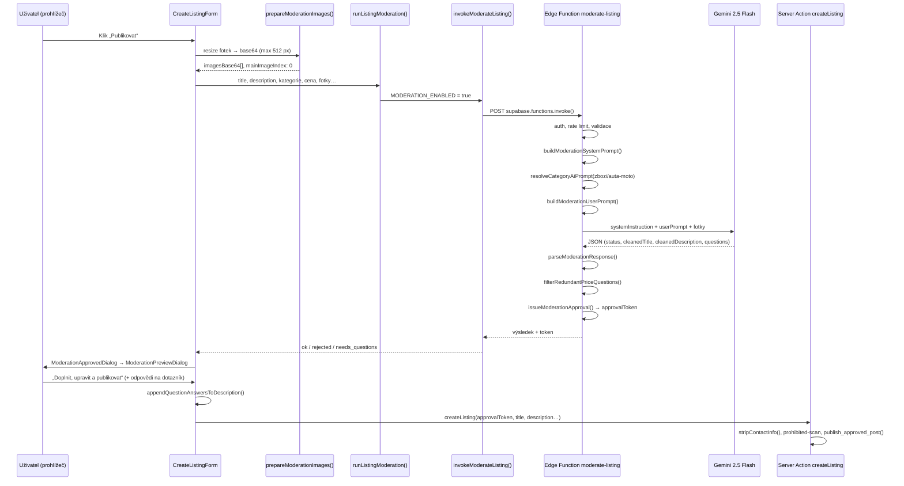

# Ukázka procesu moderace a hydratace — prodej auta

Konkrétní walkthrough: uživatel zakládá inzerát na **Škodu Rapid Spaceback** (fotka s SPZ `1TL 9939`), vyplní minimum textu a klikne **Publikovat**.

> **Důležité:** Moderace (bezpečnost) a hydratace (úprava textu) nejsou dva samostatné AI requesty. Probíhají v **jednom volání** Edge Function `moderate-listing`. System prompt obsahuje obě části; user prompt dodá kontext formuláře a kategorie.

---

## Vstupní data z formuláře (scénář)

| Pole | Hodnota |
|------|---------|
| Název | `Prodam auto` |
| Popis | `Prodám použité auto` |
| Kategorie | Zboží → Auta a moto (`zbozi` / `auta-moto`) |
| Stav | Použité |
| Typ ceny | Pevná cena |
| Cena | 95 000 Kč |
| Lokalita | Brno (do AI promptu **ne**jde — použije se až při uložení) |
| Fotky | 1× hlavní fotka (bílá Škoda Rapid Spaceback) |
| Kontakt | Chráněné pole (telefon/e-mail) — do AI promptu **ne** |

---

## Časová osa — co kam a kdy



| Krok | Kde | Co se posílá |
|------|-----|--------------|
| 1 | `prepareModerationImages()` | Fotky zmenšené na JPEG base64 (bez prefixu `data:`) |
| 2 | `invokeModerateListing()` | JSON body → Edge Function (text + metadata, **ne** aiPrompt z klienta) |
| 3 | Edge Function | Sestaví system + user prompt, přidá fotky k user části |
| 4 | Gemini API | `systemInstruction` + `contents[0].parts` = text + inline_data obrázky |
| 5 | Edge Function | Parsuje JSON, filtruje otázky o ceně, vydá `approvalToken` |
| 6 | Modal | Uživatel vidí `cleanedTitle` / `cleanedDescription` / dotazník |
| 7 | `createListing` | Finální text + `approvalToken` → DB, stav `active` |

---

## Volané funkce a soubory

### Klient (prohlížeč)

| Funkce / komponenta | Soubor |
|---------------------|--------|
| `CreateListingForm` — orchestrace | `src/components/listing/CreateListingForm.tsx` |
| `prepareModerationImages()` | `src/lib/moderation/prepare-moderation-images.ts` |
| `runListingModeration()` | `src/lib/moderation/run-listing-moderation.ts` |
| `invokeModerateListing()` | `src/lib/moderation/moderate-listing-client.ts` |
| `appendQuestionAnswersToDescription()` | `src/lib/moderation/append-question-answers.ts` |
| `ModerationApprovedDialog` | `src/components/moderation/ModerationApprovedDialog.tsx` |
| `ModerationPreviewDialog` | `src/components/moderation/ModerationPreviewDialog.tsx` |
| `createListing` (Server Action) | `src/app/actions/posts.ts` |

### Edge Function (Supabase)

| Funkce | Soubor |
|--------|--------|
| HTTP handler | `supabase/functions/moderate-listing/index.ts` |
| `buildModerationSystemPrompt()` | `supabase/functions/_shared/moderation/build-prompt.ts` |
| `buildModerationUserPrompt()` | `supabase/functions/_shared/moderation/build-user-prompt.ts` |
| `resolveCategoryAiPrompt()` | `supabase/functions/_shared/moderation/category-prompts.ts` |
| `callGeminiModeration()` | `supabase/functions/_shared/moderation/gemini.ts` |
| `parseModerationResponse()` | `supabase/functions/_shared/moderation/parse-response.ts` |
| `filterRedundantPriceQuestions()` | `supabase/functions/_shared/moderation/parse-response.ts` |
| `issueModerationApproval()` | `supabase/functions/_shared/moderation/issue-approval.ts` |
| `logModerationCheck()` | `supabase/functions/_shared/moderation/log-moderation-check.ts` |
| `assertAiModerationRateLimit()` | `supabase/functions/_shared/moderation/rate-limit.ts` |

### Konfigurace (zdroj pravdy)

| Co | Soubor |
|----|--------|
| Zakázaný obsah | `src/config/moderation/prohibited-topics.ts` |
| System prompt (reference) | `src/config/moderation/build-prompt.ts` |
| aiPrompt kategorií | `src/config/categories.ts` |
| Limity délky | `src/config/app.ts` → sync do `constants.ts` |
| Feature flag | `src/config/moderation/index.ts` (`MODERATION_ENABLED`) |

---

## Payload z klienta do Edge Function

Co `invokeModerateListing()` pošle v `body` (zkráceno — base64 fotky jsou dlouhé):

```json
{
  "intent": "create",
  "title": "Prodam auto",
  "description": "Prodám použité auto",
  "categoryType": "zbozi",
  "subcategorySlug": "auta-moto",
  "conditionLabel": "used",
  "conditionLabelText": "Použité",
  "conditionFieldLabel": "Stav",
  "priceType": "fixed",
  "priceTypeLabel": "Pevná cena",
  "priceAmount": 95000,
  "imagesBase64": ["<JPEG base64, max 512 px na delší straně>"],
  "mainImageIndex": 0
}
```

Klient **nikdy neposílá** `aiPrompt` — ten si Edge Function načte ze `category-prompts.ts` podle `categoryType` + `subcategorySlug`.

---

## System prompt (moderace + hydratace)

Sestaví `buildModerationSystemPrompt()` v `build-prompt.ts`.  
U **Gemini** se volá varianta `geminiSafe: true` — zakázané kategorie jen jako `[id] label` (bez `criteria`), aby Google neblokoval nevinné fotky.

### Část A — moderace (bezpečnost)

```
Jsi moderátor lokálního inzerátového serveru v Česku. Vyhodnoť název, popis a všechny přiložené fotografie inzerátu.

ZAMÍTNI (status REJECTED), pokud text nebo fotografie zjevně porušuje kategorii níže. U hraničních případů použij běžný rozum a český právní rámec běžného inzerátového portálu.
1. [illegal_drugs] Drogy a omamné látky
2. [weapons] Zbraně a munice
3. [sexual_services] Sexuální služby a pornografie
4. [human_organs] Lidské orgány a tkáně
5. [stolen_goods] Kradené věci
6. [counterfeit] Padělky a nelegální repliky
7. [hate_violence] Nenávist a násilí
8. [scam_fraud] Podvod a phishing
9. [animals_illegal] Nelegální obchod se zvířaty
10. [medical_prescription] Léky na předpis
11. [tobacco_alcohol_minors] Alkohol a tabák pro nezletilé
12. [minor_photos] Fotografie dětí a adolescentů
13. [gambling_illegal] Nelegální hazard

Pravidla pro fotografie:
- Bezpečnostní filtr musí projít VŠECHNY fotografie (max. 6). Zamítnutí jedné fotky = zamítnutí celého inzerátu.
- U REJECTED kvůli fotce uveď rejectedImageIndex (0-based index fotky v pořadí).
- Hlavní fotka (mainImageIndex) slouží výhradně pro cross-validaci text ↔ foto: název a popis musí odpovídat tomu, co je na hlavní fotce (náhled na homepage). Sémantická neshoda → REJECTED (konzistence).
- Pro hydrataci a doplňující otázky (NEEDS_QUESTIONS) procházej VŠECHNY přiložené fotografie — fakta z jakékoli fotky zapracuj do úvodu nebo Parametrů.

Kontakty (e-mail, telefon) v textu nejsou důvod k zamítnutí — pouze je v cleanedDescription nahraď [SKRYTO – použij chráněné pole].
```

**U našeho příkladu:** Text „Prodám použité auto“ + fotka auta = **konzistentní** → moderace nezamítne. SPZ na fotce není důvod k REJECTED (není v zakázaných kategoriích).

### Část B — hydratace (text)

Stejný system prompt pokračuje pravidly pro `cleanedDescription`:

```
Hydratace a kvalita textu (pokud obsah NENÍ REJECTED):
- Cíl hydratace: pomoci uživateli prodat — text má být čtivý, přívětivý…
- cleanedDescription piš ve dvou částech:
  1) ÚVOD: až 6 vět — co nabízíš, hlavní výhody z textu, všech fotek a formuláře, cena v úvodu
  2) PARAMETRY: po „---“ a nadpisu „Parametry“ odrážky „• Popisek: hodnota“
- Do cleanedDescription nepřidávej fakta, která nejsou v popisu, formuláři ani na fotkách.
- Co je vidět na fotkách (značka, model, barva, výbava), můžeš zapracovat.
- Pokud chybí kritická data dle kontextu kategorie, vrať NEEDS_QUESTIONS s 1–5 otázkami.
- Pokud user prompt uvádí pevnou cenu z formuláře, NIKDY se na cenu neptej.

Limit délky popisu:
- cleanedDescription max 2000 znaků
- U NEEDS_QUESTIONS max 1600 znaků (rezerva 400 na odpovědi z dotazníku)

Odpověz výhradně validním JSON:
{
  "status": "APPROVED" | "REJECTED" | "NEEDS_QUESTIONS",
  "reason": "...",
  "rejectedTopicId": "...",
  "rejectedImageIndex": 0,
  "cleanedTitle": "string",
  "cleanedDescription": "string",
  "questions": [{ "id": "string", "label": "string", "paramLabel": "string" }]
}
```

---

## User prompt (konkrétní ukázka pro náš inzerát)

Sestaví `buildModerationUserPrompt(body, categoryAiPrompt)` — sekce oddělené prázdným řádkem:

```
Úkol: moderuj inzerát (text + fotografie) a vrať JSON dle system promptu.

Formát cleanedDescription: nejdřív úvod (až 6 vět), pak „---“, nadpis „Parametry“ a odrážky • Popisek: hodnota.

Tvrdý limit délky: publikovaný popis max 2000 znaků. U NEEDS_QUESTIONS drž cleanedDescription do 1600 znaků (rezerva na odpovědi z dotazníku).

Akce: create

Kategorie: zbozi / auta-moto

Kontext kategorie pro hydrataci a doplňující otázky:
Analyzuj nabízené zboží. cleanedDescription: úvod (co prodáváš + cena v textu) a sekce Parametry s odrážkami (nájezd, rozměry, materiál, výbava, stav…). Ve formuláři dostaneš stav — u „Poškozené / na díly“ bez rozsahu vady se ptej. Doplňující otázky jen na chybějící zásadní parametry. Na cenu se neptej, pokud je ve formuláři.

Úvod + Parametry (rok, nájezd, motorizace, STK, výbava, stav). Na cenu se neptej, pokud je ve formuláři — cenu dej do úvodu. Dotazník jen na chybějící údaje.

Stav z formuláře: Použité

Typ ceny z formuláře: Pevná cena, 95 000 Kč. Do cleanedDescription vlož přímo „Cena 95 000 Kč.“ (nebo přirozeně zapracovanou do věty). Nikdy nepoužívej zástupný text [SKRYTO – použij chráněné pole] — ten je výhradně pro e-mail a telefon. Na cenu se znovu neptej.

mainImageIndex (hlavní fotka — jen cross-validace textu s náhledem): 0

Přiloženo 1 fotografií v pořadí indexů 0–0. Pro hydrataci a dotazník posuzuj všechny fotografie; fakta z jakékoli fotky zapracuj do textu.

Název inzerátu:
Prodam auto

Popis inzerátu:
Prodám použité auto
```

K user promptu Gemini přidá **1× inline obrázek** (JPEG base64) — stejná fotka Škody Rapid.

---

## Co AI typicky vrátí (ukázková odpověď)

U minimálního textu, ale srozumitelné fotky auta, očekáváme **`NEEDS_QUESTIONS`** — z fotky lze odvodit značku/model/barvu, ale chybí nájezd, rok, motorizace, STK.

```json
{
  "status": "NEEDS_QUESTIONS",
  "cleanedTitle": "Prodám Škodu Rapid Spaceback",
  "cleanedDescription": "Prodávám použitou Škodu Rapid Spaceback v bílé barvě. Auto je v dobrém vizuálním stavu, vhodné pro každodenní provoz. Cena 95 000 Kč, osobní předání po domluvě.\n\n---\n\nParametry\n• Značka a model: Škoda Rapid Spaceback\n• Barva: bílá\n• Stav: použité",
  "questions": [
    {
      "id": "q1",
      "label": "Jaký je nájezd vozidla v km?",
      "paramLabel": "Nájezd"
    },
    {
      "id": "q2",
      "label": "Z jakého roku je vozidlo?",
      "paramLabel": "Rok výroby"
    },
    {
      "id": "q3",
      "label": "Jaká je motorizace (objem a výkon)?",
      "paramLabel": "Motorizace"
    },
    {
      "id": "q4",
      "label": "Do kdy platí STK?",
      "paramLabel": "STK platná do"
    }
  ]
}
```

> Skutečná odpověď se může lišit — jde o ilustraci chování, ne garantovaný výstup modelu.

### Post-processing na Edge Function

| Funkce | Co udělá |
|--------|----------|
| `parseModerationResponse()` | Extrahuje JSON, normalizuje uvozovky, strip kontaktů v popisu |
| `filterRedundantPriceQuestions()` | Odstraní otázky typu „Jaká je cena?“ — u nás nic neodstraní (cena je ve formuláři) |
| `normalizeModerationResult()` | Doplní fallbacky pro prázdný title/description |
| `issueModerationApproval()` | Vydá `approvalToken` (TTL 30 min, váže user + počet fotek) |

Edge Function vrátí klientovi stejný JSON + `approvalToken`.

---

## Co vidí uživatel po AI

1. **Overlay** — „Probíhá AI kontrola inzerátu“ (~5–15 s)
2. **ModerationApprovedDialog** — „Inzerát je v pořádku“ → Pokračovat
3. **ModerationPreviewDialog** — editovatelný název/popis + dotazník (4 otázky)

Uživatel doplní např.:

| Otázka | Odpověď |
|--------|---------|
| Nájezd | `187000` → zobrazí se jako `187 000 km` |
| Rok výroby | `2015` |
| Motorizace | `1.2 TSI, 63 kW` |
| STK | `03/2027` |

Po kliknutí **„Doplnit, upravit a publikovat“**:

- `appendQuestionAnswersToDescription()` připojí odpovědi do sekce Parametry
- `createListing()` uloží finální text, `original_title` / `original_description` = původní „Prodam auto“ / „Prodám použité auto“
- `publish_approved_post(approvalToken)` → stav `active`

### Finální popis v DB (po sloučení odpovědí)

```
Prodávám použitou Škodu Rapid Spaceback v bílé barvě. Auto je v dobrém vizuálním stavu, vhodné pro každodenní provoz. Cena 95 000 Kč, osobní předání po domluvě.

---

Parametry
• Značka a model: Škoda Rapid Spaceback
• Barva: bílá
• Stav: použité
• Nájezd: 187 000 km
• Rok výroby: 2015
• Motorizace: 1.2 TSI, 63 kW
• STK platná do: 03/2027
```

---

## Kdy by moderace zamítla (pro srovnání)

| Situace | Status | Důvod |
|---------|--------|-------|
| Text „Prodám kolo“, fotka auta | `REJECTED` | Neshoda text ↔ hlavní fotka |
| Fotka se zbraní | `REJECTED` | `rejectedTopicId: "weapons"` |
| Text „Prodám kokain“ | `REJECTED` | `rejectedTopicId: "illegal_drugs"` |
| Fotka s rozpoznatelným dítětem | `REJECTED` | `rejectedTopicId: "minor_photos"` |

---

## Rozdělení odpovědností: moderace vs. hydratace

| Aspekt | Moderace | Hydratace |
|--------|----------|-----------|
| **Účel** | Smí obsah na web? | Jak má vypadat finální text? |
| **Výstup při úspěchu** | `APPROVED` nebo `NEEDS_QUESTIONS` | `cleanedTitle`, `cleanedDescription`, `questions` |
| **Výstup při neúspěchu** | `REJECTED` + `reason` | Nespouští se (hydratace je podmíněná „není REJECTED“) |
| **Kde v promptu** | System prompt — zakázané kategorie, fotky, cross-validace | System prompt — struktura textu; user prompt — `aiPrompt` kategorie |
| **UI** | `ModerationRejectedDialog` | `ModerationPreviewDialog` |
| **Kdy se přeskočí** | Nikdy při obsahové změně | Stejně jako moderace — jedno volání |

---

## Související dokumentace

- [`moderace-inzeratu.md`](./moderace-inzeratu.md) — pravidla, deploy, strip kontaktů
- [`hydratace-inzeratu.md`](./hydratace-inzeratu.md) — struktura popisu, dotazník, limity
- [`Metodika.md`](./Metodika.md) §6 — uživatelský popis flow
